# Diagram Visual Database - Aplikasi Unit Cost RS

## 📐 Entity Relationship Diagram (ERD)

### Diagram Lengkap

```mermaid
erDiagram
    %% ============================================
    %% MASTER DATA TABLES
    %% ============================================
    
    USERS {
        uuid id PK
        string email
        timestamp created_at
    }
    
    UNIT_KERJA {
        uuid id PK
        varchar kode UK
        text nama
        text lokasi
        integer luas_ruangan
        text jenis
        text kategori
        uuid user_id FK
        timestamp created_at
        timestamp updated_at
    }
    
    DATA_KAMAR {
        uuid id PK
        varchar Kode_Kamar
        text Nama_Kamar
        boolean Kelas_SVIP
        boolean Kelas_VIP
        boolean Kelas_I
        boolean Kelas_II
        boolean Kelas_III
        boolean Kelas_Khusus
        uuid user_id FK
    }
    
    KLINIK {
        uuid id PK
        varchar kode_klinik
        text nama_klinik
        boolean Layanan_BPJS_Kes
        boolean Layanan_Umum_Asuransi
        uuid user_id FK
    }
    
    DAFTAR_TINDAKAN {
        uuid id PK
        varchar kode_tindakan UK
        text nama_tindakan
        boolean medis
        boolean paramedis
        numeric hk_waktu
        numeric alokasi_waktu
        numeric hasil_kali
        numeric alokasi_hk
        integer profesionalisme
        integer tingkat_kesulitan
        numeric biaya_bahan_tindakan
        uuid user_id FK
    }
    
    DATA_BARANG_FARMASI {
        uuid id PK
        varchar kode_barang UK
        text nama_barang
        varchar satuan
        varchar gudang
        numeric harga
        uuid user_id FK
    }
    
    MENU_GIZI {
        uuid id PK
        varchar kode_makanan UK
        text nama_makanan
        uuid user_id FK
    }
    
    %% ============================================
    %% TRANSACTION TABLES
    %% ============================================
    
    DATA_KEGIATAN {
        uuid id PK
        integer tahun
        varchar kode_unit_kerja FK
        text nama_unit_kerja
        numeric kunjungan_pasien_baru
        numeric kunjungan_pasien_lama
        numeric lama_hari_svip
        numeric lama_hari_vip
        numeric lama_hari_i
        numeric lama_hari_ii
        numeric lama_hari_iii
        numeric Jumlah_Tindakan
        numeric jumlah_porsi_svip
        numeric jumlah_porsi_vip
        numeric total_luas_ruangan
        numeric jumlah_pegawai
        uuid user_id FK
        timestamp created_at
        timestamp updated_at
    }
    
    DATA_BIAYA {
        uuid id PK
        integer tahun
        varchar kode_unit_kerja FK
        text nama_unit_kerja
        numeric biaya_pegawai
        numeric biaya_bahan
        numeric biaya_jasa_pelayanan
        numeric biaya_pemeliharaan
        numeric biaya_barang_jasa
        numeric biaya_penyusutan
        numeric biaya_farmasi
        numeric biaya_operasional_lainnya
        uuid user_id FK
        timestamp created_at
        timestamp updated_at
    }
    
    DATA_PENDAPATAN {
        uuid id PK
        integer tahun
        varchar kode_unit_kerja FK
        text nama_unit_kerja
        numeric pendapatan_umum
        numeric pendapatan_bpjs
        uuid user_id FK
        timestamp created_at
        timestamp updated_at
    }
    
    %% ============================================
    %% CALCULATION TABLES
    %% ============================================
    
    KALKULASI_BIAYA_BDRS {
        uuid id PK
        integer tahun
        varchar kode_unit_kerja FK
        varchar kode_tindakan FK
        text nama_tindakan
        integer jumlah_pemeriksaan
        numeric biaya_overhead
        numeric biaya_sdm
        numeric biaya_bahan_farmasi
        jsonb bahan_farmasi_list
        numeric waktu_pemeriksaan
        integer profesionalisme
        integer tingkat_kesulitan
        numeric unit_cost_per_pemeriksaan
        uuid user_id FK
    }
    
    KALKULASI_BIAYA_GIZI {
        uuid id PK
        integer tahun
        varchar kode FK
        text jenis_makanan
        numeric jumlah
        numeric jumlah_svip
        numeric jumlah_vip
        numeric jumlah_kelas_i
        numeric jumlah_kelas_ii
        numeric jumlah_kelas_iii
        numeric biaya_bahan
        numeric biaya_overhead
        numeric biaya_sdm
        numeric unit_cost_per_porsi
        jsonb bahan_list
        uuid user_id FK
    }
    
    KALKULASI_BIAYA_KELAS_AKOMODASI {
        uuid id PK
        integer tahun
        varchar kode_unit_kerja FK
        text nama_unit_kerja
        text kelas_akomodasi
        numeric lama_hari
        numeric biaya_overhead
        numeric biaya_sdm
        numeric unit_cost
        uuid user_id FK
    }
    
    %% ============================================
    %% DISTRIBUTION TABLES
    %% ============================================
    
    DISTRIBUSI_BIAYA_PERTAMA {
        uuid id PK
        integer tahun
        text unit_kerja_pusat_biaya
        numeric biaya_tahunan
        text dasar_alokasi
        numeric jumlah_biaya_terdistribusi_i
        text audit_check
        numeric uk001_direktur
        numeric uk002_komite_ppi
        numeric uk077_unit_diklat
        uuid user_id FK
        timestamp created_at
    }
    
    DISTRIBUSI_BIAYA_KEDUA {
        uuid id PK
        integer tahun
        text unit_kerja_pusat_biaya
        numeric biaya_alokasi_i
        text dasar_alokasi
        text keterangan
        numeric total_alokasi_i
        text audit_check
        numeric uk037_ambulance
        numeric uk077_unit_diklat
        numeric total_alokasi_biaya_kedua
        uuid user_id FK
        timestamp updated_at
    }
    
    DISTRIBUSI_BIAYA_REKAP {
        uuid id PK
        integer tahun
        text biaya
        integer urutan
        numeric uk037_ambulance
        numeric uk077_unit_diklat
        uuid user_id FK
        timestamp updated_at
    }
    
    %% ============================================
    %% OUTPUT & REPORTING TABLES
    %% ============================================
    
    REKAPITULASI_UNIT_COST {
        uuid id PK
        integer tahun
        varchar kode_unit_kerja FK
        text nama_unit_kerja
        varchar kode_tindakan FK
        text nama_tindakan
        numeric biaya_bahan
        numeric unit_cost_per_tindakan
        text sumber_tabel
        uuid user_id FK
        timestamp created_at
    }
    
    SKENARIO_TARIF {
        uuid id PK
        integer tahun
        varchar kode_unit_kerja FK
        varchar kode_tindakan FK
        text nama_tindakan
        numeric unit_cost_per_tindakan
        numeric biaya_bahan
        numeric jasa_sarana
        numeric jasa_pelayanan_medis
        numeric jasa_pelayanan_non_medis
        numeric jasa_pelayanan
        numeric tarif_per_tindakan
        numeric prosentase_profit
        text sumber_tabel
        uuid user_id FK
    }
    
    SKENARIO_TARIF_AKOMODASI {
        uuid id PK
        integer tahun
        numeric rata_rata_uc_vvip
        numeric rata_rata_uc_vip
        numeric rata_rata_uc_i
        numeric rata_rata_uc_ii
        numeric rata_rata_uc_iii
        numeric tarif_vvip
        numeric tarif_vip
        numeric tarif_i
        numeric tarif_ii
        numeric tarif_iii
        numeric profit_rupiah_vvip
        numeric profit_persen_vvip
    }
    
    RINCIAN_BUDGETING_BHP {
        uuid id PK
        integer tahun
        varchar kode_unit_kerja FK
        varchar kode_tindakan FK
        text nama_tindakan
        numeric jumlah_tindakan
        varchar kode_barang FK
        text nama_barang
        numeric qty_per_tindakan
        varchar satuan
        numeric harga_satuan
        numeric jumlah_total
        numeric total_rupiah
        text sumber_tabel
        uuid user_id FK
    }
    
    RUPIAH_BUDGETING_BHP {
        uuid id PK
        integer tahun
        varchar kode_unit_kerja FK
        text nama_unit_kerja
        numeric total_budgeting
        integer jumlah_item_bahan
        uuid user_id FK
    }
    
    %% ============================================
    %% RELATIONSHIPS
    %% ============================================
    
    %% User ownership
    USERS ||--o{ UNIT_KERJA : owns
    USERS ||--o{ DATA_KEGIATAN : owns
    USERS ||--o{ DATA_BIAYA : owns
    USERS ||--o{ DATA_PENDAPATAN : owns
    USERS ||--o{ KALKULASI_BIAYA_BDRS : owns
    USERS ||--o{ REKAPITULASI_UNIT_COST : owns
    
    %% Master to Transaction
    UNIT_KERJA ||--o{ DATA_KEGIATAN : "has activities"
    UNIT_KERJA ||--o{ DATA_BIAYA : "has costs"
    UNIT_KERJA ||--o{ DATA_PENDAPATAN : "generates revenue"
    
    %% Master to Calculation
    UNIT_KERJA ||--o{ KALKULASI_BIAYA_BDRS : "performs"
    DAFTAR_TINDAKAN ||--o{ KALKULASI_BIAYA_BDRS : "calculated for"
    MENU_GIZI ||--o{ KALKULASI_BIAYA_GIZI : "calculated for"
    DATA_BARANG_FARMASI ||--o{ RINCIAN_BUDGETING_BHP : "used in"
    
    %% Calculation to Distribution
    DATA_BIAYA ||--|| DISTRIBUSI_BIAYA_PERTAMA : "distributed as"
    DISTRIBUSI_BIAYA_PERTAMA ||--|| DISTRIBUSI_BIAYA_KEDUA : "flows to"
    DISTRIBUSI_BIAYA_KEDUA ||--|| DISTRIBUSI_BIAYA_REKAP : "summarized in"
    
    %% Calculation to Output
    KALKULASI_BIAYA_BDRS ||--o{ REKAPITULASI_UNIT_COST : "aggregated to"
    REKAPITULASI_UNIT_COST ||--o{ SKENARIO_TARIF : "generates"
    KALKULASI_BIAYA_KELAS_AKOMODASI ||--|| SKENARIO_TARIF_AKOMODASI : "generates"
    KALKULASI_BIAYA_BDRS ||--o{ RINCIAN_BUDGETING_BHP : "details in"
    RINCIAN_BUDGETING_BHP ||--o{ RUPIAH_BUDGETING_BHP : "summarized in"
```

---

## 🔄 Data Flow Diagram

### 1. Alur Input Data Master

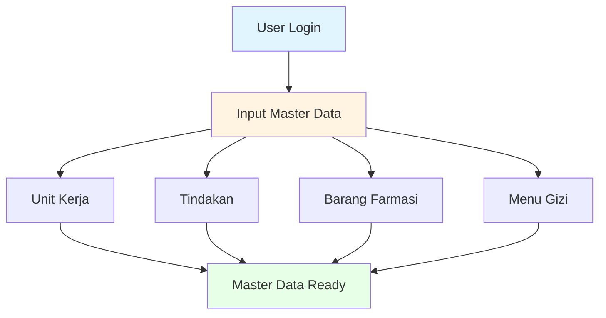

### 2. Alur Transaksi

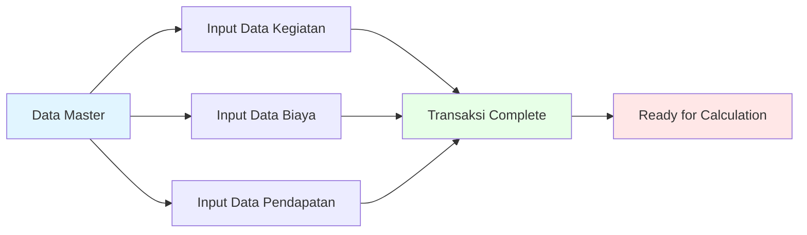

### 3. Alur Kalkulasi Unit Cost

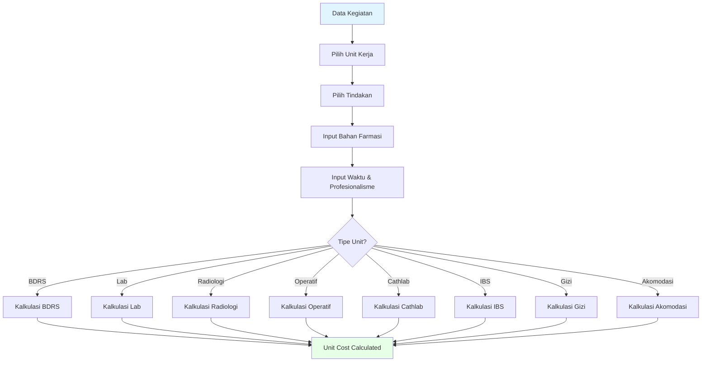

### 4. Alur Distribusi Biaya (ABC Method)

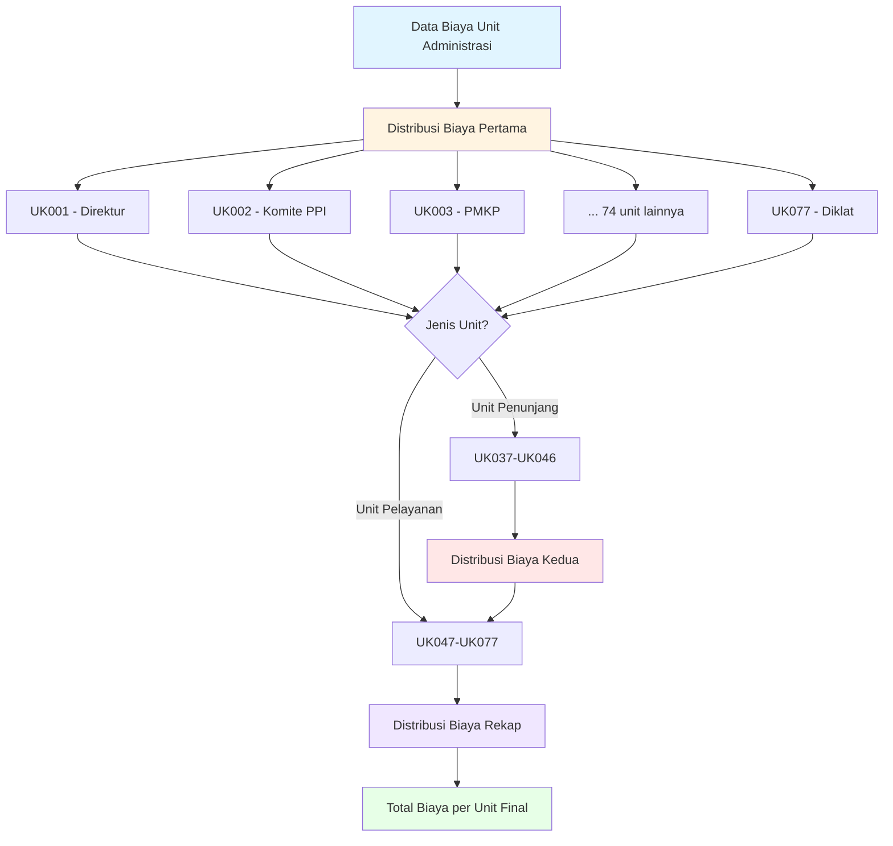

### 5. Alur Output & Reporting

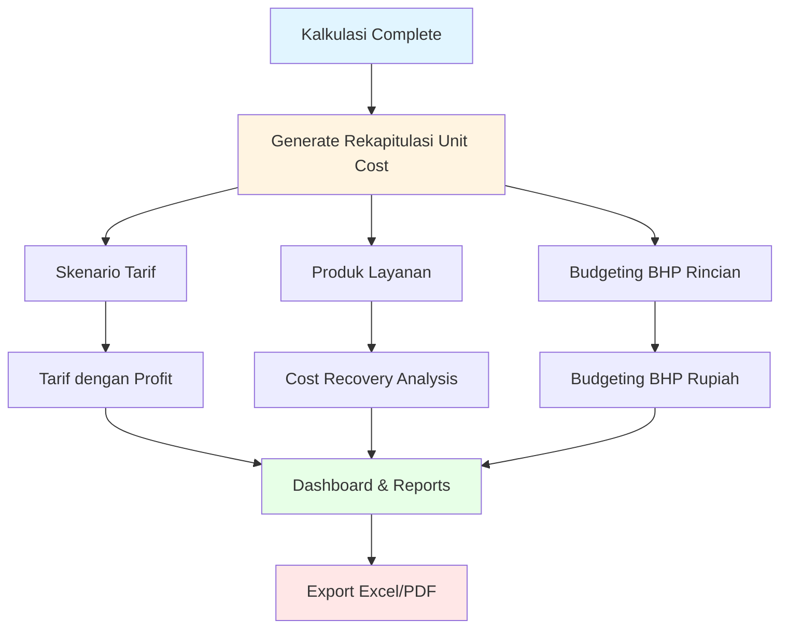

---

## 📊 Diagram Komponen Unit Cost

### Formula Kalkulasi Unit Cost

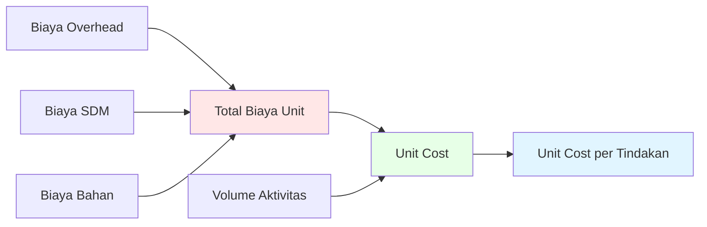

### Detail Komponen Biaya

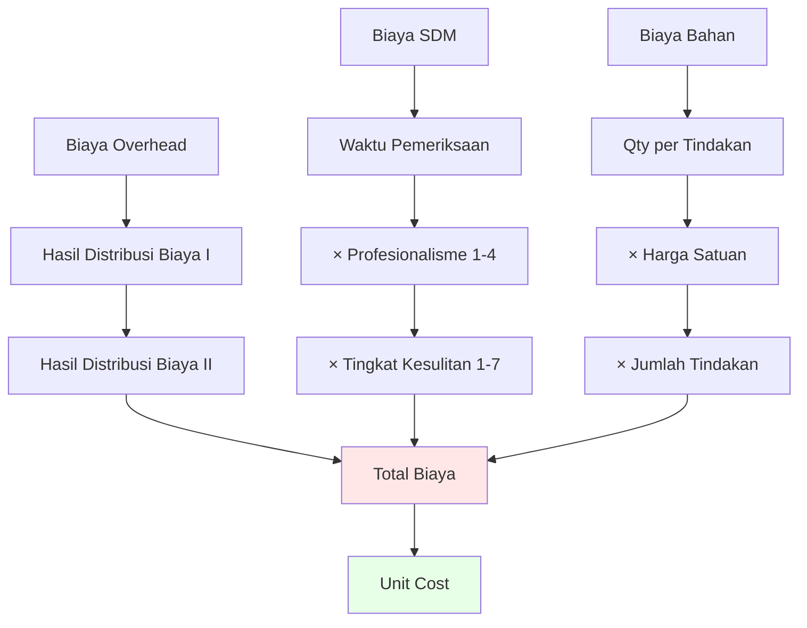

---

## 🎯 Diagram Skenario Tarif

### Komponen Tarif

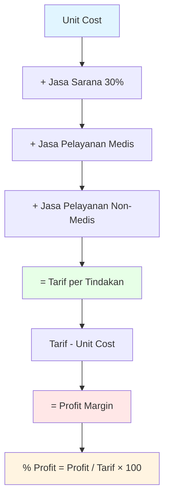

---

## 📈 Diagram Cost Recovery

### Analisis Cost Recovery Rate

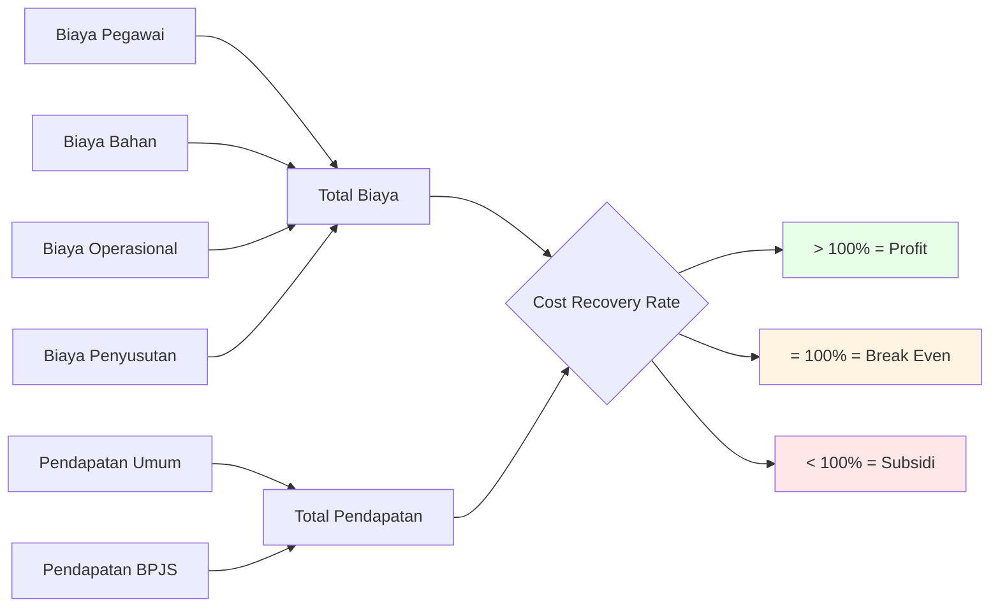

---

## 🔐 Security Architecture

### Row Level Security (RLS)

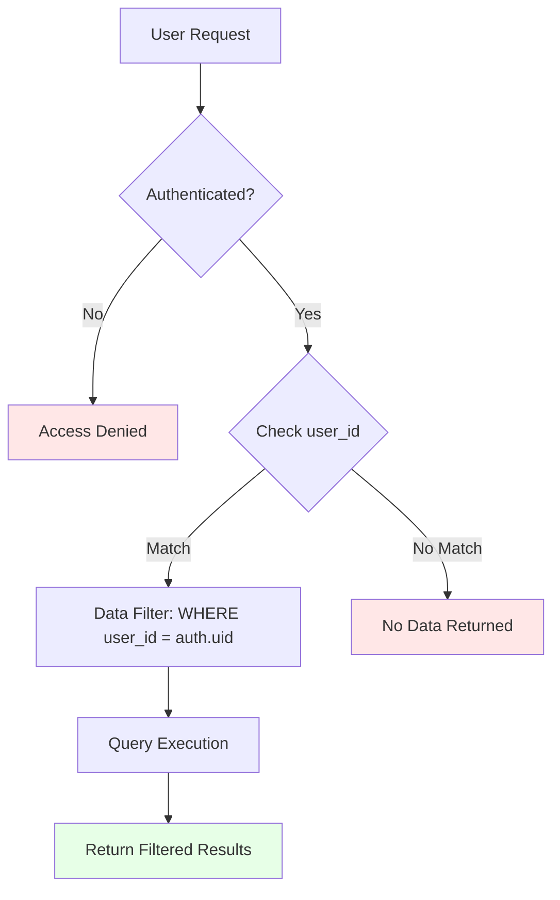

---

## 🔄 Stored Procedures Flow

### Sequence Diagram - Generate Reports

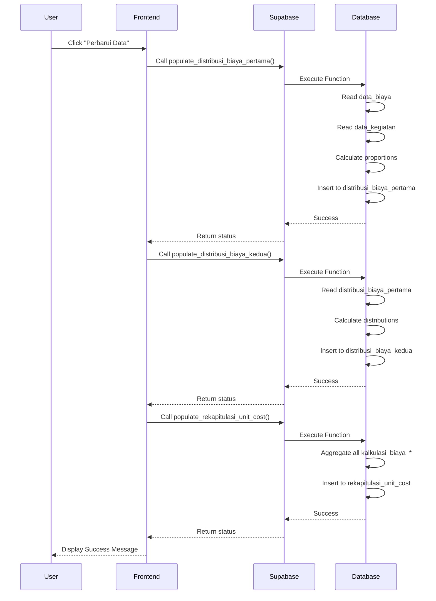

---

## 📦 Data Structure - JSONB Fields

### bahan_farmasi_list Structure

```json
[
  {
    "kode_barang": "BRG001",
    "nama": "Hansaplast 1.25 cm",
    "qty": 2,
    "harga_satuan": 5000,
    "harga_total": 10000
  },
  {
    "kode_barang": "BRG002",
    "nama": "Kasa Steril 10x10",
    "qty": 5,
    "harga_satuan": 3000,
    "harga_total": 15000
  }
]
```

### bahan_list (Gizi) Structure

```json
[
  {
    "kode_barang": "GZI001",
    "nama_barang": "Beras Premium",
    "qty": 0.2,
    "satuan": "kg",
    "harga": 15000
  },
  {
    "kode_barang": "GZI002",
    "nama_barang": "Ayam Fillet",
    "qty": 0.1,
    "satuan": "kg",
    "harga": 45000
  }
]
```

---

## 🎨 Color Coding Legend

Dalam diagram di atas, warna menunjukkan:

| Warna | Kategori | Deskripsi |
|-------|----------|-----------|
| 🔵 Biru (`#e1f5ff`) | Input/Source | Data input awal atau sumber data |
| 🟡 Kuning (`#fff4e1`) | Process | Proses transformasi atau kalkulasi |
| 🔴 Merah (`#ffe7e7`) | Critical/Important | Node penting atau hasil kritis |
| 🟣 Ungu (`#f0e7ff`) | Intermediate | Hasil sementara atau tahap tengah |
| 🟢 Hijau (`#e7ffe7`) | Output/Success | Hasil akhir atau status sukses |

---

## 📝 Notes

1. **UUID sebagai Primary Key**: Semua tabel menggunakan UUID untuk distributed system compatibility
2. **JSONB untuk Flexibility**: Bahan farmasi disimpan sebagai JSONB untuk fleksibilitas
3. **Indexing**: Index dibuat pada kolom yang sering di-query (kode, tahun, user_id)
4. **RLS Enforcement**: Semua tabel protected dengan Row Level Security
5. **Soft Delete**: Tidak ada soft delete, semua delete adalah hard delete
6. **Audit Trail**: created_at dan updated_at untuk tracking perubahan
7. **Cascade Delete**: Tidak ada cascade, harus manual delete related records

---

**Versi**: 1.0  
**Terakhir Update**: 2025-01-11

