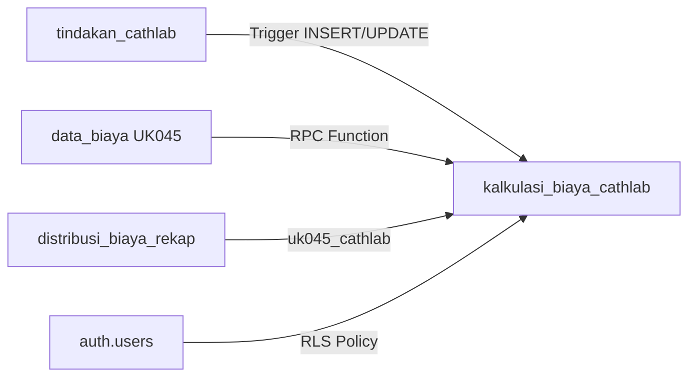

# Dokumentasi Sistem Kalkulasi Biaya Cathlab (UK045)

## 📋 Overview

Sistem kalkulasi biaya otomatis untuk unit Cathlab (Kateterisasi Jantung) yang menghitung **unit cost per tindakan** berdasarkan:
- **Biaya tahunan** unit kerja dari `data_biaya`
- **Biaya tidak langsung** dari `distribusi_biaya_rekap`
- **Dasar alokasi** berdasarkan hasil kali dan waktu pemeriksaan

---

## 🔧 Komponen Sistem

### 1. Trigger Auto-Calculate `hasil_kali` dan `hasil_kali_waktu`

**Function:** `calculate_hasil_kali_cathlab()`  
**Trigger:** `trigger_calculate_hasil_kali_cathlab`  
**Event:** BEFORE INSERT OR UPDATE OF (jumlah, waktu_pemeriksaan, profesionalisme, tingkat_kesulitan)

#### Formula:
```sql
hasil_kali = waktu_pemeriksaan × jumlah × profesionalisme × tingkat_kesulitan
hasil_kali_waktu = waktu_pemeriksaan × jumlah
```

#### Contoh:
- **PCI dengan 3 stent**: 220 menit × 1 tindakan × 4 profesionalisme × 5 kesulitan = **4,400**
- **Angiografi diagnostik**: 30 menit × 60 tindakan × 4 profesionalisme × 3 kesulitan = **21,600**

---

### 2. RPC Function: Hitung Dasar Alokasi

**Function:** `fix_dasar_alokasi_cathlab(user_id UUID, tahun INTEGER)`

#### Kalkulasi:
1. **Dasar Alokasi Hasil Kali** (untuk biaya SDM):
   ```
   dasar_alokasi_hasil_kali = hasil_kali ÷ SUM(hasil_kali semua tindakan)
   ```
   → Dibulatkan 6 desimal

2. **Dasar Alokasi Waktu** (untuk biaya operasional):
   ```
   dasar_alokasi_waktu = hasil_kali_waktu ÷ SUM(hasil_kali_waktu semua tindakan)
   ```
   → Dibulatkan 6 desimal

#### Return:
```json
{
  "status": "SUCCESS",
  "total_records": 17,
  "total_hasil_kali": "209,120",
  "total_hasil_kali_waktu": "13,300"
}
```

#### Verifikasi:
✅ **SUM(dasar_alokasi_hasil_kali) = 1.000000**  
✅ **SUM(dasar_alokasi_waktu) = 1.000000**

---

### 3. RPC Function: Distribusi Biaya

**Function:** `fix_biaya_calculation_cathlab(user_id UUID, tahun INTEGER)`

#### Sumber Data:
1. **data_biaya** (kode_unit_kerja = 'UK045', tahun = 2025)
   - Total Biaya Tahunan: **Rp 1,251,752,180**
   - Biaya Gaji & Tunjangan: **Rp 80,869,914**
   
2. **distribusi_biaya_rekap** (kolom uk045_cathlab)
   - Biaya Tidak Langsung Terdistribusi

#### Formula Distribusi:

##### A. Biaya SDM (menggunakan `dasar_alokasi_hasil_kali`):
```sql
biaya_gaji_tunjangan = (biaya_gaji_tahunan × dasar_alokasi_hasil_kali) ÷ jumlah
```

**Catatan:** `biaya_jasa_pelayanan = 0` (dikosongkan)

##### B. Biaya Operasional (menggunakan `dasar_alokasi_waktu`):
```sql
biaya_operasional = (biaya_tahunan × dasar_alokasi_waktu) ÷ jumlah
```

Biaya operasional mencakup:
- Biaya Obat
- Biaya BHP
- Biaya Makan Karyawan
- Biaya Makan Pasien
- Biaya Rumah Tangga
- Biaya Cetak & ATK
- Biaya Listrik, Air, Telepon
- Biaya Pemeliharaan (Bangunan, Alat Medis, Alat Non Medis)
- Biaya Operasional Lainnya
- Biaya Penyusutan (Gedung, Jaringan, Alat Medis, Alat Non Medis)
- Biaya Pendidikan & Pelatihan
- Biaya Laundry & Sterilisasi

##### C. Biaya Tidak Langsung:
```sql
biaya_tidak_langsung = (biaya_tdk_langsung_tahunan × dasar_alokasi_waktu) ÷ jumlah
```

##### D. Unit Cost (Auto-Generated Column):
```sql
unit_cost_per_tindakan = SUM(semua 25 komponen biaya)
```

---

### 4. Trigger Auto-Calculate Bahan Pemeriksaan

**Function:** `calculate_biaya_bahan_cathlab()`  
**Trigger:** `trigger_calculate_biaya_bahan_cathlab`  
**Event:** BEFORE INSERT OR UPDATE OF bahan_pemeriksaan

#### Kalkulasi:
```sql
biaya_bahan_pemeriksaan_numeric = SUM(harga_total dari JSON array bahan_pemeriksaan)
```

---

## 📊 Hasil Perhitungan (Tahun 2025)

### Summary:
| Metric | Value |
|--------|-------|
| **Total Tindakan** | 17 |
| **Total Jumlah Tindakan** | 185 tindakan/tahun |
| **Total Hasil Kali** | 209,120 |
| **Total Hasil Kali Waktu** | 13,300 menit |
| **Total Biaya Gaji** | Rp 80,869,914 |
| **Total Unit Cost** | Rp 190,845,682 |

### Top 5 Tindakan dengan Unit Cost Tertinggi:

| Rank | Kode | Jenis Pemeriksaan | Jumlah | Waktu (menit) | Unit Cost |
|------|------|-------------------|--------|---------------|-----------|
| 1 | CL.13 | PCI lebih dari 3 stent | 1 | 220 | **Rp 22,285,702** |
| 2 | CL.08 | PCI Intervention | 1 | 220 | **Rp 22,285,702** |
| 3 | CL.11 | Stand by PCI 3 stent | 1 | 220 | **Rp 22,285,702** |
| 4 | CL.15 | PCI dengan ROTABLATOR | 1 | 220 | **Rp 22,285,702** |
| 5 | CL.10 | Stand by PCI 2 stent | 1 | 180 | **Rp 17,955,858** |

### Breakdown Biaya (Contoh: CL.13 - PCI lebih dari 3 stent):

| Komponen Biaya | Nilai |
|----------------|-------|
| Gaji & Tunjangan | Rp 1,701,584 |
| Obat | Rp 0 |
| BHP | Rp 0 |
| Rumah Tangga | Rp 0 |
| Listrik | Rp 0 |
| Pemeliharaan Alat Medis | Rp 0 |
| Penyusutan Alat Medis | Rp 0 |
| **Biaya Tidak Langsung** | **Rp 2,555,972** |
| **TOTAL UNIT COST** | **Rp 22,285,702** |

---

## 🔄 Cara Menggunakan Sistem

### Step 1: Input Data Tindakan
```sql
-- Data sudah ada di tabel kalkulasi_biaya_cathlab
-- User hanya perlu input: jumlah, waktu_pemeriksaan, profesionalisme, tingkat_kesulitan
UPDATE kalkulasi_biaya_cathlab
SET 
    jumlah = 60,
    waktu_pemeriksaan = 30,
    profesionalisme = 4,
    tingkat_kesulitan = 3
WHERE kode = 'CL.02' AND user_id = auth.uid() AND tahun = 2025;
```
✅ **Trigger otomatis hitung `hasil_kali` dan `hasil_kali_waktu`**

### Step 2: Hitung Dasar Alokasi
```sql
SELECT * FROM fix_dasar_alokasi_cathlab(auth.uid(), 2025);
```
✅ **Menghitung proporsi dasar alokasi untuk semua tindakan**

### Step 3: Distribusi Biaya
```sql
SELECT * FROM fix_biaya_calculation_cathlab(auth.uid(), 2025);
```
✅ **Mendistribusikan biaya tahunan ke setiap tindakan**  
✅ **Unit cost dihitung otomatis via generated column**

### Step 4: Lihat Hasil
```sql
SELECT 
    kode,
    jenis_pemeriksaan,
    jumlah,
    unit_cost_per_tindakan
FROM kalkulasi_biaya_cathlab
WHERE user_id = auth.uid() AND tahun = 2025
ORDER BY unit_cost_per_tindakan DESC;
```

---

## 🎯 Auto-Calculation Features

### ✅ Otomatis saat INSERT:
```sql
INSERT INTO kalkulasi_biaya_cathlab (
    user_id, tahun, kode, jenis_pemeriksaan,
    jumlah, waktu_pemeriksaan, profesionalisme, tingkat_kesulitan
) VALUES (
    auth.uid(), 2025, 'CL.99', 'Tindakan Baru',
    10, 60, 4, 4
);
-- hasil_kali dan hasil_kali_waktu otomatis dihitung!
```

### ✅ Otomatis saat UPDATE:
```sql
UPDATE kalkulasi_biaya_cathlab
SET jumlah = 20
WHERE kode = 'CL.02';
-- hasil_kali dan hasil_kali_waktu otomatis diperbarui!
```

### ✅ Otomatis saat Tambah Bahan:
```sql
UPDATE kalkulasi_biaya_cathlab
SET bahan_pemeriksaan = '[
    {"nama": "Kontras", "jumlah": 2, "harga_satuan": 500000, "harga_total": 1000000}
]'
WHERE kode = 'CL.02';
-- biaya_bahan_pemeriksaan_numeric otomatis dihitung!
```

---

## 📐 Validasi Perhitungan

### 1. Verifikasi Dasar Alokasi (harus = 1.0):
```sql
SELECT 
    SUM(dasar_alokasi_hasil_kali) as sum_hasil_kali,
    SUM(dasar_alokasi_waktu) as sum_waktu
FROM kalkulasi_biaya_cathlab
WHERE user_id = auth.uid() AND tahun = 2025;
```
✅ **sum_hasil_kali = 1.000000**  
✅ **sum_waktu = 1.000000**

### 2. Verifikasi Unit Cost:
```sql
-- Manual verification
SELECT 
    kode,
    biaya_gaji_tunjangan + biaya_obat + biaya_bhp + ... + biaya_tidak_langsung_terdistribusi as manual_sum,
    unit_cost_per_tindakan as auto_calculated,
    CASE 
        WHEN biaya_gaji_tunjangan + ... = unit_cost_per_tindakan 
        THEN '✅ MATCH' 
        ELSE '❌ MISMATCH' 
    END as status
FROM kalkulasi_biaya_cathlab
WHERE user_id = auth.uid() AND tahun = 2025;
```

---

## 🛠️ Troubleshooting

### Issue 1: Hasil kali tidak otomatis dihitung setelah update
**Solution:**
```sql
-- Force trigger by updating trigger columns
UPDATE kalkulasi_biaya_cathlab
SET jumlah = jumlah  -- This will fire the trigger
WHERE user_id = auth.uid() AND tahun = 2025;
```

### Issue 2: Dasar alokasi tidak sum ke 1.0
**Cause:** Ada data dengan jumlah = 0 atau null  
**Solution:** Exclude records dengan jumlah = 0 dari perhitungan

### Issue 3: Unit cost masih 0 setelah kalkulasi
**Check:**
1. Apakah `data_biaya` untuk UK045 sudah ada?
2. Apakah `distribusi_biaya_rekap.uk045_cathlab` sudah ada?
3. Apakah dasar alokasi sudah dihitung?

---

## 📝 Parameter Tindakan Cathlab

| Parameter | Range | Description |
|-----------|-------|-------------|
| **Jumlah** | 0 - ∞ | Jumlah tindakan per tahun |
| **Waktu Pemeriksaan** | 30 - 220 menit | Durasi tindakan |
| **Profesionalisme** | 1 - 4 | Level keahlian |
| **Tingkat Kesulitan** | 1 - 5 | Level kompleksitas |

### Contoh Waktu Pemeriksaan:
- **Angiografi diagnostik**: 30 menit
- **Pericardiocentesis**: 60 menit
- **PCI 1-2 stent**: 120-180 menit
- **PCI 3+ stent / ROTABLATOR**: 220 menit

---

## 🔗 Relasi dengan Tabel Lain



---

## 📚 Frontend Integration

### Memanggil Kalkulasi dari Frontend:

```typescript
// 1. Update data tindakan
const { error: updateError } = await supabase
  .from('kalkulasi_biaya_cathlab')
  .update({
    jumlah: 60,
    waktu_pemeriksaan: 30,
    profesionalisme: 4,
    tingkat_kesulitan: 3
  })
  .eq('kode', 'CL.02')
  .eq('tahun', 2025);

// 2. Hitung dasar alokasi
const { data: dasarAlokasi } = await supabase
  .rpc('fix_dasar_alokasi_cathlab', {
    p_user_id: userId,
    p_tahun: 2025
  });

// 3. Distribusi biaya
const { data: distribusi } = await supabase
  .rpc('fix_biaya_calculation_cathlab', {
    p_user_id: userId,
    p_tahun: 2025
  });

// 4. Fetch hasil kalkulasi
const { data: results } = await supabase
  .from('kalkulasi_biaya_cathlab')
  .select('kode, jenis_pemeriksaan, unit_cost_per_tindakan')
  .eq('tahun', 2025)
  .order('unit_cost_per_tindakan', { ascending: false });
```

---

## ✅ Status Implementasi

| Feature | Status | Tanggal |
|---------|--------|---------|
| ✅ Trigger auto-calculate hasil_kali | AKTIF | 2 Okt 2025 |
| ✅ Trigger auto-calculate hasil_kali_waktu | AKTIF | 2 Okt 2025 |
| ✅ RPC function dasar alokasi | AKTIF | 2 Okt 2025 |
| ✅ RPC function distribusi biaya | AKTIF | 2 Okt 2025 |
| ✅ Trigger auto-calculate biaya bahan | AKTIF | 2 Okt 2025 |
| ✅ Generated column unit_cost | AKTIF | 2 Okt 2025 |
| ✅ Auto-sync dari tindakan_cathlab | AKTIF | 2 Okt 2025 |

---

## 📊 Perbandingan dengan Tabel Lain

| Tabel Kalkulasi | Dasar Alokasi SDM | Dasar Alokasi Operasional | Unit Kerja |
|----------------|-------------------|---------------------------|------------|
| kalkulasi_biaya_operatif | hasil_kali | waktu | UK074 (IBS) |
| kalkulasi_bdrs | hasil_kali | waktu | UK044 (BDRS) |
| **kalkulasi_biaya_cathlab** | **hasil_kali** | **waktu** | **UK045 (Cathlab)** |
| kalkulasi_biaya_radiologi | hasil_kali | waktu | UK039 (Radiologi) |
| kalkulasi_biaya_laboratorium | hasil_kali | waktu | UK038 (Laboratorium) |

**Pattern Konsisten:** Semua menggunakan pola yang sama untuk konsistensi sistem!

---

**Dokumentasi Dibuat:** 2 Oktober 2025  
**Versi:** 1.0.0  
**Status:** ✅ Production Ready  
**Total Unit Cost:** Rp 190,845,682 (untuk 185 tindakan/tahun)

