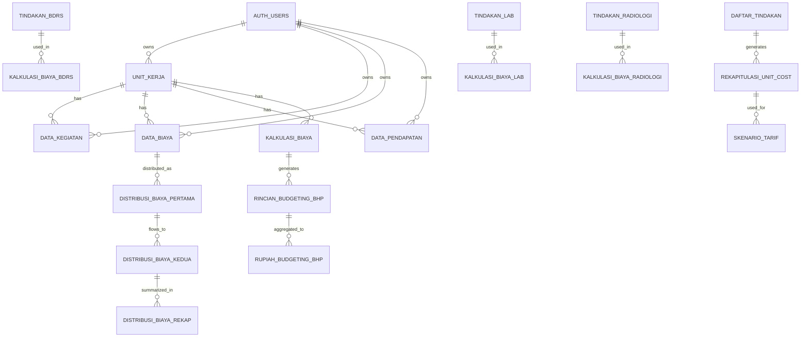

# Dokumentasi Struktur Skema Database - Aplikasi Unit Cost RS

## Daftar Isi
1. [Gambaran Umum](#gambaran-umum)
2. [Diagram Relasi Database](#diagram-relasi-database)
3. [Tabel Master Data](#tabel-master-data)
4. [Tabel Transaksi](#tabel-transaksi)
5. [Tabel Kalkulasi](#tabel-kalkulasi)
6. [Tabel Distribusi Biaya](#tabel-distribusi-biaya)
7. [Tabel Output & Reporting](#tabel-output--reporting)
8. [Views](#views)
9. [Stored Procedures](#stored-procedures)
10. [Relasi Antar Tabel](#relasi-antar-tabel)

---

## Gambaran Umum

Aplikasi Unit Cost RS menggunakan **Supabase (PostgreSQL)** sebagai database backend. Database ini dirancang untuk menghitung unit cost layanan rumah sakit dengan pendekatan **Activity Based Costing (ABC)** dan melakukan distribusi biaya bertahap.

### Teknologi Stack
- **Database**: PostgreSQL (Supabase)
- **Backend**: Supabase (BaaS)
- **Frontend**: React + TypeScript + Vite
- **State Management**: TanStack Query (React Query)
- **UI Framework**: Tailwind CSS + shadcn/ui

---

## Diagram Relasi Database

### Alur Data Utama
```
[Master Data] → [Data Kegiatan/Biaya/Pendapatan] → [Kalkulasi Biaya]
                                                           ↓
                                                  [Distribusi Biaya I]
                                                           ↓
                                                  [Distribusi Biaya II]
                                                           ↓
                                                  [Rekapitulasi & Output]
```

---

## Tabel Master Data

### 1. `unit_kerja`
**Deskripsi**: Menyimpan informasi unit kerja/cost center di rumah sakit

| Kolom | Tipe | Keterangan |
|-------|------|------------|
| id | UUID | Primary Key |
| kode | VARCHAR(50) | Kode unit kerja (UK001, UK002, dll) |
| nama | TEXT | Nama unit kerja |
| lokasi | TEXT | Lokasi fisik unit kerja |
| luas_ruangan | INTEGER | Luas ruangan dalam m² |
| jenis | TEXT | Jenis: "Pusat Biaya" atau "Pusat Pendapatan" |
| kategori | TEXT | Kategori: "Administrasi Umum", "Unit Penunjang", dll |
| user_id | UUID | Foreign Key ke auth.users |
| created_at | TIMESTAMP | Waktu pembuatan |
| updated_at | TIMESTAMP | Waktu update terakhir |

**Index**: 
- `idx_unit_kerja_kode` pada kolom `kode`
- `idx_unit_kerja_user_id` pada kolom `user_id`

---

### 2. `data_kamar`
**Deskripsi**: Data kamar rawat inap beserta kelasnya

| Kolom | Tipe | Keterangan |
|-------|------|------------|
| id | UUID | Primary Key |
| Kode_Kamar | VARCHAR(50) | Kode kamar |
| Nama_Kamar | TEXT | Nama kamar |
| Kelas_SVIP | BOOLEAN | Kamar kelas SVIP/VVIP |
| Kelas_VIP | BOOLEAN | Kamar kelas VIP |
| Kelas_I | BOOLEAN | Kamar kelas I |
| Kelas_II | BOOLEAN | Kamar kelas II |
| Kelas_III | BOOLEAN | Kamar kelas III |
| Kelas_Khusus | BOOLEAN | Kamar kelas khusus |
| user_id | UUID | Foreign Key ke auth.users |

---

### 3. `klinik`
**Deskripsi**: Daftar klinik/poli yang tersedia

| Kolom | Tipe | Keterangan |
|-------|------|------------|
| id | UUID | Primary Key |
| kode_klinik | VARCHAR(50) | Kode klinik |
| nama_klinik | TEXT | Nama klinik |
| Layanan_BPJS_Kes | BOOLEAN | Melayani BPJS |
| Layanan_Umum_Asuransi | BOOLEAN | Melayani Umum/Asuransi |
| user_id | UUID | Foreign Key ke auth.users |

---

### 4. `daftar_tindakan`
**Deskripsi**: Master daftar tindakan medis dan non-medis

| Kolom | Tipe | Keterangan |
|-------|------|------------|
| id | UUID | Primary Key |
| kode_tindakan | VARCHAR(50) | Kode tindakan |
| nama_tindakan | TEXT | Nama tindakan |
| medis | BOOLEAN | Tindakan medis (true/false) |
| paramedis | BOOLEAN | Tindakan paramedis (true/false) |
| hk_waktu | NUMERIC | HK waktu |
| alokasi_waktu | NUMERIC | Alokasi waktu |
| hasil_kali | NUMERIC | Hasil kali = HK waktu × Alokasi waktu |
| alokasi_hk | NUMERIC | Alokasi HK |
| profesionalisme | INTEGER | Tingkat profesionalisme (1-4) |
| tingkat_kesulitan | INTEGER | Tingkat kesulitan (1-5) |
| biaya_bahan_tindakan | NUMERIC | Biaya bahan untuk tindakan |
| user_id | UUID | Foreign Key ke auth.users |

---

### 5. `tindakan_cathlab`
**Deskripsi**: Daftar tindakan kateterisasi jantung

| Kolom | Tipe | Keterangan |
|-------|------|------------|
| id | UUID | Primary Key |
| kode_tindakan | VARCHAR(50) | Kode tindakan |
| nama_tindakan | TEXT | Nama tindakan cathlab |
| user_id | UUID | Foreign Key ke auth.users |

---

### 6. `tindakan_bdrs` (Bedah Digestif Rumah Sakit)
**Deskripsi**: Daftar tindakan bedah digestif

| Kolom | Tipe | Keterangan |
|-------|------|------------|
| id | UUID | Primary Key |
| kode | VARCHAR(50) | Kode tindakan |
| nama | TEXT | Nama tindakan BDRS |
| user_id | UUID | Foreign Key ke auth.users |

---

### 7. `tindakan_ibs` (Instalasi Bedah Sentral)
**Deskripsi**: Daftar tindakan di instalasi bedah sentral

| Kolom | Tipe | Keterangan |
|-------|------|------------|
| id | UUID | Primary Key |
| kode_tindakan | VARCHAR(50) | Kode tindakan |
| nama_tindakan | TEXT | Nama tindakan |
| kode_operator | VARCHAR(50) | Kode operator bedah |
| nama_operator | TEXT | Nama operator bedah |
| user_id | UUID | Foreign Key ke auth.users |

---

### 8. `tindakan_laboratorium`
**Deskripsi**: Daftar tindakan pemeriksaan laboratorium

| Kolom | Tipe | Keterangan |
|-------|------|------------|
| id | UUID | Primary Key |
| jenis | VARCHAR(10) | Jenis: "PK", "PA", "Mi" |
| kode_tindakan | VARCHAR(50) | Kode tindakan |
| nama_tindakan | TEXT | Nama tindakan |
| user_id | UUID | Foreign Key ke auth.users |

---

### 9. `tindakan_radiologi`
**Deskripsi**: Daftar tindakan pemeriksaan radiologi

| Kolom | Tipe | Keterangan |
|-------|------|------------|
| id | UUID | Primary Key |
| kode_tindakan | VARCHAR(50) | Kode tindakan (auto-generated) |
| nama_tindakan | TEXT | Nama tindakan |
| user_id | UUID | Foreign Key ke auth.users |

---

### 10. `tindakan_operatif`
**Deskripsi**: Daftar tindakan operatif

| Kolom | Tipe | Keterangan |
|-------|------|------------|
| id | UUID | Primary Key |
| kode_tindakan | VARCHAR(50) | Kode tindakan |
| nama_tindakan | TEXT | Nama tindakan |
| kode_operator | VARCHAR(50) | Kode operator |
| nama_operator | TEXT | Nama operator |
| user_id | UUID | Foreign Key ke auth.users |

---

### 11. `menu_gizi`
**Deskripsi**: Daftar menu makanan pasien

| Kolom | Tipe | Keterangan |
|-------|------|------------|
| id | UUID | Primary Key |
| kode_makanan | VARCHAR(50) | Kode menu |
| nama_makanan | TEXT | Nama menu |
| user_id | UUID | Foreign Key ke auth.users |

---

### 12. `data_barang_farmasi`
**Deskripsi**: Master data obat dan BHP

| Kolom | Tipe | Keterangan |
|-------|------|------------|
| id | UUID | Primary Key |
| kode_barang | VARCHAR(50) | Kode barang |
| nama_barang | TEXT | Nama barang |
| satuan | VARCHAR(20) | Satuan (botol, tablet, dll) |
| gudang | VARCHAR(10) | "obat" atau "bhp" |
| harga | NUMERIC | Harga satuan |
| user_id | UUID | Foreign Key ke auth.users |

---

### 13. `data_barang_gizi`
**Deskripsi**: Master data bahan makanan

| Kolom | Tipe | Keterangan |
|-------|------|------------|
| id | UUID | Primary Key |
| kode_barang | VARCHAR(50) | Kode bahan |
| nama_barang | TEXT | Nama bahan |
| satuan | VARCHAR(20) | Satuan |
| harga | NUMERIC | Harga per satuan |
| user_id | UUID | Foreign Key ke auth.users |

---

### 14. `data_diklat`
**Deskripsi**: Master data materi pendidikan dan pelatihan

| Kolom | Tipe | Keterangan |
|-------|------|------------|
| id | UUID | Primary Key |
| kode_strata | VARCHAR(50) | Kode strata (S1, S2, D3, dll) |
| kode_materi | VARCHAR(50) | Kode materi |
| nama_materi | TEXT | Nama materi |
| user_id | UUID | Foreign Key ke auth.users |

---

## Tabel Transaksi

### 15. `data_kegiatan`
**Deskripsi**: Data aktivitas/kegiatan unit kerja per tahun

| Kolom | Tipe | Keterangan |
|-------|------|------------|
| id | UUID | Primary Key |
| tahun | INTEGER | Tahun data |
| kode_unit_kerja | VARCHAR(50) | FK ke unit_kerja.kode |
| nama_unit_kerja | TEXT | Nama unit kerja |
| **1. Aktifitas Layanan Administrasi** | | |
| kunjungan_pasien_baru | NUMERIC | Jumlah pasien baru |
| kunjungan_pasien_lama | NUMERIC | Jumlah pasien lama |
| **2. Aktifitas Layanan Rawat Inap** | | |
| lama_hari_svip | NUMERIC | Lama hari rawat SVIP |
| lama_hari_vip | NUMERIC | Lama hari rawat VIP |
| lama_hari_i | NUMERIC | Lama hari rawat kelas I |
| lama_hari_ii | NUMERIC | Lama hari rawat kelas II |
| lama_hari_iii | NUMERIC | Lama hari rawat kelas III |
| kamar_luas_svip | NUMERIC | Luas kamar SVIP |
| kamar_luas_vip | NUMERIC | Luas kamar VIP |
| kamar_luas_i | NUMERIC | Luas kamar I |
| kamar_luas_ii | NUMERIC | Luas kamar II |
| kamar_luas_iii | NUMERIC | Luas kamar III |
| **3. Aktifitas Layanan** | | |
| Kunjungan_Pasien_Lama | NUMERIC | (duplikat untuk kompatibilitas) |
| Kunjungan_Pasien_Baru | NUMERIC | (duplikat untuk kompatibilitas) |
| Jumlah_Tindakan | NUMERIC | Total tindakan |
| Resep_Lembar_Resep | NUMERIC | Jumlah lembar resep |
| **4. Aktifitas Pendukung** | | |
| Cucian_kg_Cucian | NUMERIC | Berat cucian (kg) |
| Instrumen_Besar | NUMERIC | Jumlah instrumen besar |
| Instrumen_Sedang | NUMERIC | Jumlah instrumen sedang |
| Instrumen_Kecil | NUMERIC | Jumlah instrumen kecil |
| Set_Pack_Besar | NUMERIC | Jumlah set pack besar |
| Set_Pack_Sedang | NUMERIC | Jumlah set pack sedang |
| Set_Pack_Kecil | NUMERIC | Jumlah set pack kecil |
| Makanan_Karyawan_jml_Porsi | NUMERIC | Porsi makan karyawan |
| Makanan_Pasien_jml_Porsi | NUMERIC | Porsi makan pasien |
| jumlah_porsi_svip | NUMERIC | Porsi SVIP |
| jumlah_porsi_vip | NUMERIC | Porsi VIP |
| jumlah_porsi_i | NUMERIC | Porsi kelas I |
| jumlah_porsi_ii | NUMERIC | Porsi kelas II |
| jumlah_porsi_iii | NUMERIC | Porsi kelas III |
| **5. Investasi Sarana** | | |
| nilai_aset | NUMERIC | Nilai investasi aset |
| **6. Luas Ruangan** | | |
| total_luas_ruangan | NUMERIC | Total luas (m²) |
| **7. Kegiatan Diklat** | | |
| Diklat_Lama_Hari | NUMERIC | Lama diklat (hari) |
| **8. Jumlah Pegawai** | | |
| jumlah_pegawai | NUMERIC | Total pegawai |
| user_id | UUID | Foreign Key ke auth.users |
| created_at | TIMESTAMP | Waktu pembuatan |
| updated_at | TIMESTAMP | Waktu update |

---

### 16. `data_biaya`
**Deskripsi**: Data biaya operasional unit kerja per tahun

| Kolom | Tipe | Keterangan |
|-------|------|------------|
| id | UUID | Primary Key |
| tahun | INTEGER | Tahun anggaran |
| kode_unit_kerja | VARCHAR(50) | FK ke unit_kerja.kode |
| nama_unit_kerja | TEXT | Nama unit kerja |
| biaya_pegawai | NUMERIC | Biaya gaji & tunjangan |
| biaya_bahan | NUMERIC | Biaya bahan habis pakai |
| biaya_jasa_pelayanan | NUMERIC | Biaya jasa pelayanan |
| biaya_pemeliharaan | NUMERIC | Biaya pemeliharaan |
| biaya_barang_jasa | NUMERIC | Biaya barang dan jasa |
| biaya_penyusutan | NUMERIC | Biaya penyusutan aset |
| biaya_farmasi | NUMERIC | Biaya obat & farmasi |
| biaya_operasional_lainnya | NUMERIC | Biaya operasional lain |
| user_id | UUID | Foreign Key ke auth.users |
| created_at | TIMESTAMP | Waktu pembuatan |
| updated_at | TIMESTAMP | Waktu update |

**Calculated Field**:
- `total_biaya` = SUM(semua kolom biaya_*)

---

### 17. `data_pendapatan`
**Deskripsi**: Data pendapatan unit kerja per tahun

| Kolom | Tipe | Keterangan |
|-------|------|------------|
| id | UUID | Primary Key |
| tahun | INTEGER | Tahun |
| kode_unit_kerja | VARCHAR(50) | FK ke unit_kerja.kode |
| nama_unit_kerja | TEXT | Nama unit kerja |
| pendapatan_umum | NUMERIC | Pendapatan dari pasien umum |
| pendapatan_bpjs | NUMERIC | Pendapatan dari BPJS |
| user_id | UUID | Foreign Key ke auth.users |
| created_at | TIMESTAMP | Waktu pembuatan |
| updated_at | TIMESTAMP | Waktu update |

**Calculated Field**:
- `total_pendapatan` = pendapatan_umum + pendapatan_bpjs

---

## Tabel Kalkulasi

### 18. `kalkulasi_biaya_bdrs`
**Deskripsi**: Kalkulasi biaya tindakan BDRS

| Kolom | Tipe | Keterangan |
|-------|------|------------|
| id | UUID | Primary Key |
| tahun | INTEGER | Tahun |
| kode_unit_kerja | VARCHAR(50) | FK ke unit_kerja |
| nama_unit_kerja | TEXT | Nama unit kerja |
| kode_tindakan | VARCHAR(50) | FK ke tindakan_bdrs |
| nama_tindakan | TEXT | Nama tindakan |
| jenis_pemeriksaan | TEXT | Jenis pemeriksaan |
| jumlah_pemeriksaan | INTEGER | Jumlah pemeriksaan |
| biaya_overhead | NUMERIC | Biaya overhead |
| biaya_sdm | NUMERIC | Biaya SDM |
| biaya_bahan_farmasi | NUMERIC | Biaya bahan |
| bahan_farmasi_list | JSONB | Detail bahan [{kode, nama, qty, harga}] |
| waktu_pemeriksaan | NUMERIC | Waktu (menit) |
| profesionalisme | INTEGER | Tingkat profesionalisme (1-4) |
| tingkat_kesulitan | INTEGER | Tingkat kesulitan (1-5) |
| unit_cost_per_pemeriksaan | NUMERIC | Unit cost |
| user_id | UUID | Foreign Key ke auth.users |

---

### 19. `kalkulasi_biaya_laboratorium`
**Deskripsi**: Kalkulasi biaya pemeriksaan laboratorium

| Kolom | Tipe | Keterangan |
|-------|------|------------|
| id | UUID | Primary Key |
| tahun | INTEGER | Tahun |
| kode_unit_kerja | VARCHAR(50) | FK ke unit_kerja |
| nama_unit_kerja | TEXT | Nama unit kerja |
| kode_tindakan | VARCHAR(50) | FK ke tindakan_laboratorium |
| nama_tindakan | TEXT | Nama pemeriksaan |
| jenis_pemeriksaan | TEXT | PK/PA/Mi |
| jumlah_pemeriksaan | INTEGER | Jumlah |
| biaya_overhead | NUMERIC | Biaya overhead |
| biaya_sdm | NUMERIC | Biaya SDM |
| biaya_bahan_farmasi | NUMERIC | Biaya bahan |
| bahan_farmasi_list | JSONB | Detail bahan |
| waktu_pemeriksaan | NUMERIC | Waktu |
| profesionalisme | INTEGER | 1-4 |
| tingkat_kesulitan | INTEGER | 1-5 |
| unit_cost_per_pemeriksaan | NUMERIC | Unit cost |
| user_id | UUID | Foreign Key ke auth.users |

---

### 20. `kalkulasi_biaya_radiologi`
**Deskripsi**: Kalkulasi biaya pemeriksaan radiologi

| Kolom | Tipe | Keterangan |
|-------|------|------------|
| id | UUID | Primary Key |
| tahun | INTEGER | Tahun |
| kode_unit_kerja | VARCHAR(50) | FK ke unit_kerja |
| nama_unit_kerja | TEXT | Nama unit kerja |
| kode_tindakan | VARCHAR(50) | FK ke tindakan_radiologi |
| nama_tindakan | TEXT | Nama pemeriksaan |
| jenis_pemeriksaan | TEXT | Jenis |
| jumlah_pemeriksaan | INTEGER | Jumlah |
| biaya_overhead | NUMERIC | Biaya overhead |
| biaya_sdm | NUMERIC | Biaya SDM |
| biaya_bahan_farmasi | NUMERIC | Biaya bahan |
| bahan_farmasi_list | JSONB | Detail bahan |
| waktu_pemeriksaan | NUMERIC | Waktu |
| profesionalisme | INTEGER | 1-4 |
| tingkat_kesulitan | INTEGER | 1-5 |
| unit_cost_per_pemeriksaan | NUMERIC | Unit cost |
| user_id | UUID | Foreign Key ke auth.users |

---

### 21. `kalkulasi_biaya_operatif`
**Deskripsi**: Kalkulasi biaya tindakan operatif

| Kolom | Tipe | Keterangan |
|-------|------|------------|
| id | UUID | Primary Key |
| tahun | INTEGER | Tahun |
| kode_unit_kerja | VARCHAR(50) | FK ke unit_kerja |
| nama_unit_kerja | TEXT | Nama unit kerja |
| kode_tindakan | VARCHAR(50) | FK ke tindakan_operatif |
| nama_tindakan | TEXT | Nama tindakan |
| kode_operator | VARCHAR(50) | Kode operator |
| nama_operator | TEXT | Nama operator |
| jumlah_tindakan | INTEGER | Jumlah |
| biaya_overhead | NUMERIC | Biaya overhead |
| biaya_sdm | NUMERIC | Biaya SDM |
| biaya_bahan_farmasi | NUMERIC | Biaya bahan |
| bahan_farmasi_list | JSONB | Detail bahan |
| waktu_pemeriksaan | NUMERIC | Waktu |
| profesionalisme | INTEGER | 1-4 |
| tingkat_kesulitan | INTEGER | 1-7 |
| unit_cost_per_tindakan | NUMERIC | Unit cost |
| user_id | UUID | Foreign Key ke auth.users |

---

### 22. `kalkulasi_biaya_cathlab`
**Deskripsi**: Kalkulasi biaya tindakan cathlab

| Kolom | Tipe | Keterangan |
|-------|------|------------|
| id | UUID | Primary Key |
| tahun | INTEGER | Tahun |
| kode_unit_kerja | VARCHAR(50) | FK ke unit_kerja |
| nama_unit_kerja | TEXT | Nama unit kerja |
| kode_tindakan | VARCHAR(50) | FK ke tindakan_cathlab |
| nama_tindakan | TEXT | Nama tindakan |
| jumlah_tindakan | INTEGER | Jumlah |
| biaya_overhead | NUMERIC | Biaya overhead |
| biaya_sdm | NUMERIC | Biaya SDM |
| biaya_bahan_farmasi | NUMERIC | Biaya bahan |
| bahan_farmasi_list | JSONB | Detail bahan |
| waktu_pemeriksaan | NUMERIC | Waktu |
| profesionalisme | INTEGER | 1-4 |
| tingkat_kesulitan | INTEGER | 1-5 |
| unit_cost_per_tindakan | NUMERIC | Unit cost |
| user_id | UUID | Foreign Key ke auth.users |

---

### 23. `kalkulasi_biaya_ibs`
**Deskripsi**: Kalkulasi biaya tindakan IBS

| Kolom | Tipe | Keterangan |
|-------|------|------------|
| id | UUID | Primary Key |
| tahun | INTEGER | Tahun |
| kode_unit_kerja | VARCHAR(50) | FK ke unit_kerja |
| nama_unit_kerja | TEXT | Nama unit kerja |
| kode_tindakan | VARCHAR(50) | FK ke tindakan_ibs |
| nama_tindakan | TEXT | Nama tindakan |
| jenis_pemeriksaan | TEXT | Jenis |
| jumlah_pemeriksaan | INTEGER | Jumlah |
| biaya_overhead | NUMERIC | Biaya overhead |
| biaya_sdm | NUMERIC | Biaya SDM |
| biaya_bahan_farmasi | NUMERIC | Biaya bahan |
| bahan_farmasi_list | JSONB | Detail bahan |
| waktu_pemeriksaan | NUMERIC | Waktu |
| profesionalisme | INTEGER | 1-4 |
| tingkat_kesulitan | INTEGER | 1-5 |
| unit_cost_per_pemeriksaan | NUMERIC | Unit cost |
| user_id | UUID | Foreign Key ke auth.users |

---

### 24. `kalkulasi_biaya_gizi`
**Deskripsi**: Kalkulasi biaya menu makanan per kelas

| Kolom | Tipe | Keterangan |
|-------|------|------------|
| id | UUID | Primary Key |
| tahun | INTEGER | Tahun |
| kode | VARCHAR(50) | FK ke menu_gizi |
| jenis_makanan | TEXT | Nama menu |
| jumlah | NUMERIC | Total porsi |
| jumlah_svip | NUMERIC | Porsi SVIP |
| jumlah_vip | NUMERIC | Porsi VIP |
| jumlah_kelas_i | NUMERIC | Porsi kelas I |
| jumlah_kelas_ii | NUMERIC | Porsi kelas II |
| jumlah_kelas_iii | NUMERIC | Porsi kelas III |
| biaya_bahan | NUMERIC | Total biaya bahan |
| biaya_overhead | NUMERIC | Biaya overhead |
| biaya_sdm | NUMERIC | Biaya SDM |
| unit_cost_per_porsi | NUMERIC | Unit cost per porsi |
| bahan_list | JSONB | Detail bahan [{kode, nama, qty, harga}] |
| user_id | UUID | Foreign Key ke auth.users |

---

### 25. `kalkulasi_biaya_kelas_akomodasi`
**Deskripsi**: Kalkulasi biaya per kelas rawat inap

| Kolom | Tipe | Keterangan |
|-------|------|------------|
| id | UUID | Primary Key |
| tahun | INTEGER | Tahun |
| kode_unit_kerja | VARCHAR(50) | FK ke unit_kerja |
| nama_unit_kerja | TEXT | Nama unit kerja |
| kelas_akomodasi | TEXT | VVIP/VIP/I/II/III |
| lama_hari | NUMERIC | Total hari rawat |
| biaya_overhead | NUMERIC | Biaya overhead |
| biaya_sdm | NUMERIC | Biaya SDM |
| unit_cost | NUMERIC | Unit cost per hari |
| user_id | UUID | Foreign Key ke auth.users |

---

## Tabel Distribusi Biaya

### 26. `distribusi_biaya_pertama`
**Deskripsi**: Distribusi biaya tahap I dari unit non-produktif ke produktif

| Kolom | Tipe | Keterangan |
|-------|------|------------|
| id | UUID | Primary Key |
| tahun | INTEGER | Tahun |
| unit_kerja_pusat_biaya | TEXT | Unit sumber biaya |
| biaya_tahunan | NUMERIC | Total biaya |
| dasar_alokasi | TEXT | Dasar alokasi (m², pegawai, dll) |
| jumlah_biaya_terdistribusi_i | NUMERIC | Total biaya terdistribusi |
| audit_check | TEXT | Status audit |
| uk001_direktur | NUMERIC | Alokasi ke UK001 |
| uk002_komite_ppi | NUMERIC | Alokasi ke UK002 |
| uk003_komite_pmkp | NUMERIC | Alokasi ke UK003 |
| ... | NUMERIC | (kolom UK004 - UK077) |
| uk077_unit_diklat | NUMERIC | Alokasi ke UK077 |
| user_id | UUID | Foreign Key ke auth.users |
| created_at | TIMESTAMP | Waktu pembuatan |

**Total kolom UK**: 77 kolom (UK001 - UK077)

---

### 27. `distribusi_biaya_kedua`
**Deskripsi**: Distribusi biaya tahap II dari unit penunjang ke unit pelayanan

| Kolom | Tipe | Keterangan |
|-------|------|------------|
| id | UUID | Primary Key |
| tahun | INTEGER | Tahun |
| unit_kerja_pusat_biaya | TEXT | Unit sumber biaya |
| biaya_alokasi_i | NUMERIC | Biaya hasil distribusi I |
| dasar_alokasi | TEXT | Dasar alokasi |
| keterangan | TEXT | Keterangan tambahan |
| total_alokasi_i | NUMERIC | Total alokasi I |
| audit_check | TEXT | Status audit |
| uk037_ambulance | NUMERIC | Alokasi ke UK037 |
| uk038_laboratorium_pk_pa | NUMERIC | Alokasi ke UK038 |
| ... | NUMERIC | (kolom UK039 - UK077) |
| uk077_unit_diklat | NUMERIC | Alokasi ke UK077 |
| total_alokasi_biaya_kedua | NUMERIC | Total biaya terdistribusi |
| user_id | UUID | Foreign Key ke auth.users |
| updated_at | TIMESTAMP | Waktu update |

**Total kolom UK**: 41 kolom (UK037 - UK077)

---

### 28. `distribusi_biaya_rekap`
**Deskripsi**: Rekapitulasi distribusi biaya final

| Kolom | Tipe | Keterangan |
|-------|------|------------|
| id | UUID | Primary Key |
| tahun | INTEGER | Tahun |
| biaya | TEXT | Jenis biaya |
| urutan | INTEGER | Urutan tampilan |
| uk037_ambulance | NUMERIC | Total biaya UK037 |
| uk038_laboratorium_pk_pa | NUMERIC | Total biaya UK038 |
| ... | NUMERIC | (kolom UK039 - UK077) |
| uk077_unit_diklat | NUMERIC | Total biaya UK077 |
| user_id | UUID | Foreign Key ke auth.users |
| updated_at | TIMESTAMP | Waktu update |

**Calculated Field**:
- `total` = SUM(uk037...uk077)

---

## Tabel Output & Reporting

### 29. `rekapitulasi_unit_cost`
**Deskripsi**: Rekapitulasi final unit cost per tindakan

| Kolom | Tipe | Keterangan |
|-------|------|------------|
| id | UUID | Primary Key |
| tahun | INTEGER | Tahun |
| kode_unit_kerja | VARCHAR(50) | Kode unit kerja |
| nama_unit_kerja | TEXT | Nama unit kerja |
| kode_operator | VARCHAR(50) | Kode operator (jika ada) |
| nama_operator | TEXT | Nama operator (jika ada) |
| kode_tindakan | VARCHAR(50) | Kode tindakan |
| nama_tindakan | TEXT | Nama tindakan |
| biaya_bahan | NUMERIC | Total biaya bahan |
| unit_cost_per_tindakan | NUMERIC | Unit cost final |
| sumber_tabel | TEXT | Sumber data (tabel kalkulasi) |
| user_id | UUID | Foreign Key ke auth.users |
| created_at | TIMESTAMP | Waktu pembuatan |

**Index**:
- `idx_rekapitulasi_unit_cost_tahun` pada kolom `tahun`
- `idx_rekapitulasi_unit_cost_unit_kerja` pada kolom `kode_unit_kerja`

---

### 30. `produk_layanan`
**Deskripsi**: Analisis produk layanan dengan pendapatan

| Kolom | Tipe | Keterangan |
|-------|------|------------|
| id | UUID | Primary Key |
| tahun | INTEGER | Tahun |
| kode_unit_kerja | VARCHAR(50) | FK ke unit_kerja |
| nama_unit_kerja | TEXT | Nama unit kerja |
| kode_layanan | VARCHAR(50) | Kode layanan/tindakan |
| nama_layanan | TEXT | Nama layanan |
| jumlah | NUMERIC | Volume layanan |
| unit_cost | NUMERIC | Unit cost |
| total_unit_cost | NUMERIC | Unit cost × jumlah |
| pendapatan | NUMERIC | Pendapatan |
| selisih | NUMERIC | Pendapatan - total_unit_cost |
| prosentase_saldo | NUMERIC | (Selisih / Pendapatan) × 100 |
| user_id | UUID | Foreign Key ke auth.users |

---

### 31. `skenario_tarif`
**Deskripsi**: Skenario tarif dengan margin profit

| Kolom | Tipe | Keterangan |
|-------|------|------------|
| id | UUID | Primary Key |
| tahun | INTEGER | Tahun |
| kode_unit_kerja | VARCHAR(50) | FK ke unit_kerja |
| nama_unit_kerja | TEXT | Nama unit kerja |
| kode_tindakan | VARCHAR(50) | Kode tindakan |
| nama_tindakan | TEXT | Nama tindakan |
| unit_cost_per_tindakan | NUMERIC | Unit cost |
| biaya_bahan | NUMERIC | Biaya bahan |
| jasa_sarana | NUMERIC | Jasa sarana (30% dari unit cost) |
| jasa_pelayanan_medis | NUMERIC | Jasa pelayanan medis |
| jasa_pelayanan_non_medis | NUMERIC | Jasa pelayanan non medis |
| jasa_pelayanan | NUMERIC | Total jasa pelayanan |
| tarif_per_tindakan | NUMERIC | Tarif yang diusulkan |
| prosentase_profit | NUMERIC | Persentase profit |
| sumber_tabel | TEXT | Sumber data |
| user_id | UUID | Foreign Key ke auth.users |

---

### 32. `skenario_tarif_akomodasi`
**Deskripsi**: Skenario tarif rawat inap per kelas

| Kolom | Tipe | Keterangan |
|-------|------|------------|
| id | UUID | Primary Key |
| tahun | INTEGER | Tahun |
| rata_rata_uc_vvip | NUMERIC | Rata-rata UC VVIP |
| rata_rata_uc_vip | NUMERIC | Rata-rata UC VIP |
| rata_rata_uc_i | NUMERIC | Rata-rata UC kelas I |
| rata_rata_uc_ii | NUMERIC | Rata-rata UC kelas II |
| rata_rata_uc_iii | NUMERIC | Rata-rata UC kelas III |
| tarif_vvip | NUMERIC | Tarif VVIP |
| tarif_vip | NUMERIC | Tarif VIP |
| tarif_i | NUMERIC | Tarif kelas I |
| tarif_ii | NUMERIC | Tarif kelas II |
| tarif_iii | NUMERIC | Tarif kelas III |
| profit_rupiah_vvip | NUMERIC | Profit Rp VVIP |
| profit_rupiah_vip | NUMERIC | Profit Rp VIP |
| profit_rupiah_i | NUMERIC | Profit Rp kelas I |
| profit_rupiah_ii | NUMERIC | Profit Rp kelas II |
| profit_rupiah_iii | NUMERIC | Profit Rp kelas III |
| profit_persen_vvip | NUMERIC | Profit % VVIP |
| profit_persen_vip | NUMERIC | Profit % VIP |
| profit_persen_i | NUMERIC | Profit % kelas I |
| profit_persen_ii | NUMERIC | Profit % kelas II |
| profit_persen_iii | NUMERIC | Profit % kelas III |

---

### 33. `rincian_budgeting_bhp`
**Deskripsi**: Rincian budgeting bahan habis pakai per tindakan

| Kolom | Tipe | Keterangan |
|-------|------|------------|
| id | UUID | Primary Key |
| tahun | INTEGER | Tahun |
| kode_unit_kerja | VARCHAR(50) | FK ke unit_kerja |
| nama_unit_kerja | TEXT | Nama unit kerja |
| kode_tindakan | VARCHAR(50) | Kode tindakan |
| nama_tindakan | TEXT | Nama tindakan |
| jumlah_tindakan | NUMERIC | Volume tindakan |
| kode_barang | VARCHAR(50) | FK ke data_barang_farmasi |
| nama_barang | TEXT | Nama barang |
| qty_per_tindakan | NUMERIC | Qty per tindakan |
| satuan | VARCHAR(20) | Satuan |
| harga_satuan | NUMERIC | Harga satuan |
| jumlah_total | NUMERIC | Total qty |
| total_rupiah | NUMERIC | Total nilai rupiah |
| sumber_tabel | TEXT | Sumber data |
| user_id | UUID | Foreign Key ke auth.users |

---

### 34. `rupiah_budgeting_bhp`
**Deskripsi**: Rekapitulasi budgeting BHP per unit kerja

| Kolom | Tipe | Keterangan |
|-------|------|------------|
| id | UUID | Primary Key |
| tahun | INTEGER | Tahun |
| kode_unit_kerja | VARCHAR(50) | FK ke unit_kerja |
| nama_unit_kerja | TEXT | Nama unit kerja |
| total_budgeting | NUMERIC | Total budgeting BHP |
| jumlah_item_bahan | INTEGER | Jumlah jenis bahan |
| user_id | UUID | Foreign Key ke auth.users |

---

## Views

### 35. `view_cost_recovery`
**Deskripsi**: View untuk analisis cost recovery rate

```sql
CREATE VIEW view_cost_recovery AS
SELECT 
  uk.kode AS kode_unit_kerja,
  uk.nama AS nama_unit_kerja,
  db.tahun,
  db.total_biaya,
  dp.total_pendapatan,
  (dp.total_pendapatan / NULLIF(db.total_biaya, 0)) * 100 AS cost_recovery_rate,
  dp.total_pendapatan - db.total_biaya AS selisih
FROM unit_kerja uk
LEFT JOIN data_biaya db ON uk.kode = db.kode_unit_kerja
LEFT JOIN data_pendapatan dp ON uk.kode = dp.kode_unit_kerja 
  AND db.tahun = dp.tahun
WHERE uk.jenis = 'Pusat Pendapatan';
```

---

## Stored Procedures

### 36. `populate_distribusi_biaya_pertama(p_user_id UUID, p_tahun INTEGER)`
**Deskripsi**: Generate data distribusi biaya tahap I

**Logika**:
1. Ambil data biaya dari `data_biaya` untuk unit Administrasi Umum
2. Ambil data kegiatan dari `data_kegiatan` sebagai dasar alokasi
3. Hitung proporsi alokasi berdasarkan dasar alokasi (m², pegawai, dll)
4. Distribusikan biaya ke 77 unit kerja (UK001-UK077)
5. Insert/Update ke tabel `distribusi_biaya_pertama`

---

### 37. `populate_distribusi_biaya_kedua(p_user_id UUID, p_tahun INTEGER)`
**Deskripsi**: Generate data distribusi biaya tahap II

**Logika**:
1. Ambil hasil distribusi biaya pertama
2. Ambil biaya unit penunjang (UK037-UK077)
3. Distribusikan ke unit pelayanan berdasarkan aktivitas
4. Insert/Update ke tabel `distribusi_biaya_kedua`

---

### 38. `populate_distribusi_biaya_rekap(p_user_id UUID, p_tahun INTEGER)`
**Deskripsi**: Generate rekapitulasi distribusi biaya

**Logika**:
1. Aggregate hasil distribusi biaya pertama dan kedua
2. Kategorikan per jenis biaya
3. Insert/Update ke tabel `distribusi_biaya_rekap`

---

### 39. `populate_rekapitulasi_unit_cost(p_user_id UUID, p_tahun INTEGER)`
**Deskripsi**: Generate rekapitulasi unit cost

**Logika**:
1. Collect semua data dari tabel kalkulasi_biaya_*
2. Standardize format output
3. Insert/Update ke tabel `rekapitulasi_unit_cost`

---

### 40. `populate_skenario_tarif(p_user_id UUID, p_tahun INTEGER)`
**Deskripsi**: Generate skenario tarif

**Logika**:
1. Ambil data dari rekapitulasi_unit_cost
2. Hitung jasa sarana (30% dari unit cost)
3. Hitung jasa pelayanan
4. Hitung tarif dan profit margin
5. Insert/Update ke tabel `skenario_tarif`

---

### 41. `populate_skenario_tarif_akomodasi(p_user_id UUID, p_tahun INTEGER)`
**Deskripsi**: Generate skenario tarif akomodasi

**Logika**:
1. Ambil data dari kalkulasi_biaya_kelas_akomodasi
2. Hitung rata-rata unit cost per kelas
3. Set tarif dan hitung profit
4. Insert/Update ke tabel `skenario_tarif_akomodasi`

---

### 42. `populate_rincian_budgeting_bhp(p_user_id UUID, p_tahun INTEGER)`
**Deskripsi**: Generate rincian budgeting BHP

**Logika**:
1. Extract bahan_farmasi_list dari semua tabel kalkulasi
2. Join dengan data jumlah tindakan
3. Kalkulasi total qty dan rupiah
4. Insert/Update ke tabel `rincian_budgeting_bhp`

---

### 43. `populate_rupiah_budgeting_bhp(p_user_id UUID, p_tahun INTEGER)`
**Deskripsi**: Generate rekapitulasi budgeting BHP per unit

**Logika**:
1. Aggregate dari rincian_budgeting_bhp
2. Group by unit_kerja
3. Insert/Update ke tabel `rupiah_budgeting_bhp`

---

## Relasi Antar Tabel

### Relasi Master Data
```
unit_kerja (1) ←→ (N) data_kegiatan
unit_kerja (1) ←→ (N) data_biaya
unit_kerja (1) ←→ (N) data_pendapatan
unit_kerja (1) ←→ (N) kalkulasi_biaya_*
```

### Relasi Kalkulasi
```
daftar_tindakan (1) ←→ (N) rekapitulasi_unit_cost
tindakan_* (1) ←→ (N) kalkulasi_biaya_*
data_barang_farmasi (1) ←→ (N) bahan_farmasi_list (JSONB)
menu_gizi (1) ←→ (N) kalkulasi_biaya_gizi
```

### Relasi Distribusi
```
data_biaya (1) ←→ (N) distribusi_biaya_pertama
distribusi_biaya_pertama (1) ←→ (N) distribusi_biaya_kedua
distribusi_biaya_kedua (1) ←→ (N) distribusi_biaya_rekap
```

### Relasi Output
```
rekapitulasi_unit_cost (1) ←→ (N) skenario_tarif
kalkulasi_biaya_kelas_akomodasi (1) ←→ (N) skenario_tarif_akomodasi
kalkulasi_biaya_* (1) ←→ (N) rincian_budgeting_bhp
rincian_budgeting_bhp (1) ←→ (N) rupiah_budgeting_bhp
```

---

## Diagram ER (Entity Relationship)



---

## Best Practices

### 1. **Normalisasi Data**
- Master data dinormalisasi untuk menghindari redundansi
- Gunakan foreign key untuk menjaga integritas referensial
- Gunakan JSONB untuk data yang bersifat dinamis (bahan_farmasi_list)

### 2. **Indexing**
- Index pada kolom yang sering di-query (kode_unit_kerja, tahun, user_id)
- Index pada foreign keys
- Composite index untuk kombinasi filter yang sering digunakan

### 3. **Naming Convention**
- Table names: lowercase, underscore_separated
- Column names: lowercase, underscore_separated
- FK names: <referenced_table>_id
- Index names: idx_<table>_<column>

### 4. **Data Types**
- UUID untuk primary keys (distributed system friendly)
- NUMERIC untuk nilai moneter (presisi tinggi)
- TIMESTAMP WITH TIME ZONE untuk datetime
- JSONB untuk data semi-structured

### 5. **Row Level Security (RLS)**
- Semua tabel menggunakan RLS
- User hanya bisa akses data miliknya sendiri (filter by user_id)
- Admin memiliki akses penuh

### 6. **Audit Trail**
- `created_at` untuk tracking waktu pembuatan
- `updated_at` untuk tracking waktu update terakhir
- `user_id` untuk tracking ownership

---

## Kesimpulan

Database ini dirancang untuk mendukung perhitungan **Activity Based Costing (ABC)** dengan fitur:

✅ **Master data terstruktur** untuk unit kerja, tindakan, dan bahan
✅ **Multi-tahap distribusi biaya** (Administrasi → Penunjang → Pelayanan)
✅ **Kalkulasi unit cost otomatis** per jenis layanan
✅ **Skenario tarif** dengan analisis profit margin
✅ **Budgeting BHP** yang detail dan akurat
✅ **Cost recovery analysis** untuk evaluasi kinerja finansial
✅ **Data isolation** per user dengan RLS
✅ **Scalable & maintainable** architecture

---

**Versi**: 1.0  
**Terakhir Update**: 2025-01-11  
**Dibuat oleh**: Tim Pengembang Aplikasi Unit Cost RS

