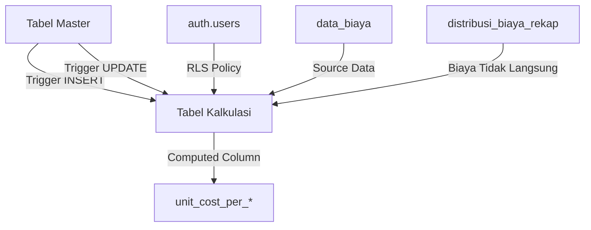
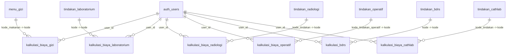

# Dokumentasi Skema Database - Aplikasi Unit Cost RS

## 📋 Daftar Isi

1. [Gambaran Umum](#gambaran-umum)
2. [Arsitektur Database](#arsitektur-database)
3. [Skema Tabel Master](#skema-tabel-master)
4. [Skema Tabel Kalkulasi](#skema-tabel-kalkulasi)
5. [Sistem Auto-Sync Triggers](#sistem-auto-sync-triggers)
6. [Relasi Antar Tabel](#relasi-antar-tabel)
7. [Row Level Security (RLS)](#row-level-security-rls)
8. [Indexes dan Performance](#indexes-dan-performance)
9. [Computed Columns](#computed-columns)
10. [Best Practices](#best-practices)

---

## 📖 Gambaran Umum

Database ini dirancang untuk menghitung **Unit Cost** berbagai layanan kesehatan di rumah sakit. Sistem terdiri dari:

- **6 Tabel Master** - Sumber data tindakan/menu
- **6 Tabel Kalkulasi** - Perhitungan biaya per unit
- **Auto-Sync Triggers** - Sinkronisasi otomatis master → kalkulasi
- **Computed Columns** - Kalkulasi otomatis unit cost
- **RLS Policies** - Keamanan data per user

### Total Tabel: 12 Tabel Utama

| Kategori | Tabel Master | Tabel Kalkulasi | Jumlah Data |
|----------|-------------|-----------------|-------------|
| Gizi | menu_gizi | kalkulasi_biaya_gizi | 115 |
| Laboratorium | tindakan_laboratorium | kalkulasi_biaya_laboratorium | 125 |
| Radiologi | tindakan_radiologi | kalkulasi_biaya_radiologi | 79 |
| Operatif | tindakan_operatif | kalkulasi_biaya_operatif | 213 |
| BDRS | tindakan_bdrs | kalkulasi_bdrs | 11 |
| Cathlab | tindakan_cathlab | kalkulasi_biaya_cathlab | 17 |

---

## 🏗️ Arsitektur Database



### Prinsip Desain

1. **Single Source of Truth** - Master table adalah sumber utama
2. **Auto-Sync** - Perubahan di master otomatis sync ke kalkulasi
3. **Multi-User** - Setiap user punya data kalkulasi sendiri
4. **Multi-Year** - Support multiple tahun untuk tracking historis
5. **Audit Trail** - Timestamp created_at & updated_at

---

## 📊 Skema Tabel Master

### 1. menu_gizi

**Deskripsi:** Master data menu makanan untuk gizi  
**Total Kolom:** 5  
**Total Records:** 115

#### Struktur Kolom:
```sql
CREATE TABLE menu_gizi (
    id SERIAL PRIMARY KEY,
    kode_makanan VARCHAR UNIQUE CHECK (kode_makanan ~ '^gz\.[0-9]+$'),
    nama_makanan VARCHAR NOT NULL,
    created_at TIMESTAMPTZ DEFAULT NOW(),
    updated_at TIMESTAMPTZ DEFAULT NOW()
);
```

#### Triggers:
- `trigger_menu_gizi_kode_makanan` (BEFORE INSERT) - Auto-generate kode
- `trigger_sync_new_menu_gizi` (AFTER INSERT) - Sync ke kalkulasi
- `trigger_update_menu_gizi` (AFTER UPDATE) - Update nama di kalkulasi

---

### 2. tindakan_laboratorium

**Deskripsi:** Master data tindakan pemeriksaan laboratorium  
**Total Kolom:** 5  
**Total Records:** 125

#### Struktur Kolom:
```sql
CREATE TABLE tindakan_laboratorium (
    id UUID PRIMARY KEY DEFAULT gen_random_uuid(),
    jenis USER-DEFINED (enum: 'PK', 'PA', 'Mi'),
    kode TEXT UNIQUE NOT NULL,
    nama TEXT NOT NULL,
    created_at TIMESTAMPTZ DEFAULT NOW()
);
```

#### Jenis Pemeriksaan:
- **PK** - Patologi Klinik
- **PA** - Patologi Anatomi  
- **Mi** - Mikrobiologi

#### Triggers:
- `trigger_sync_new_tindakan_lab` (AFTER INSERT) - Sync ke kalkulasi
- `trigger_update_tindakan_lab` (AFTER UPDATE) - Update nama di kalkulasi

---

### 3. tindakan_radiologi

**Deskripsi:** Master data tindakan pemeriksaan radiologi  
**Total Kolom:** 5  
**Total Records:** 79

#### Struktur Kolom:
```sql
CREATE TABLE tindakan_radiologi (
    id UUID PRIMARY KEY DEFAULT gen_random_uuid(),
    kode_tindakan TEXT UNIQUE CHECK (kode_tindakan ~ '^Rad\.[0-9]+$'),
    nama_tindakan TEXT NOT NULL,
    created_at TIMESTAMPTZ DEFAULT NOW(),
    updated_at TIMESTAMPTZ DEFAULT NOW()
);
```

#### Triggers:
- `trigger_sync_new_tindakan_radiologi` (AFTER INSERT) - Sync ke kalkulasi
- `trigger_update_tindakan_radiologi` (AFTER UPDATE) - Update nama di kalkulasi
- `update_tindakan_radiologi_updated_at` (BEFORE UPDATE) - Update timestamp

---

### 4. tindakan_operatif

**Deskripsi:** Master data tindakan operasi/prosedur operatif  
**Total Kolom:** 8  
**Total Records:** 213

#### Struktur Kolom:
```sql
CREATE TABLE tindakan_operatif (
    id UUID PRIMARY KEY DEFAULT gen_random_uuid(),
    kode_jenis SMALLINT DEFAULT 3 CHECK (kode_jenis IN (1, 2, 3)),
    kode_operator_spesialistik VARCHAR,
    nama_operator_spesialistik VARCHAR,
    kode_tindakan_operatif VARCHAR UNIQUE NOT NULL,
    nama_tindakan_operatif VARCHAR NOT NULL,
    created_at TIMESTAMPTZ DEFAULT NOW(),
    updated_at TIMESTAMPTZ DEFAULT NOW()
);
```

#### Kode Jenis:
- **1** - Operasi Jenis 1
- **2** - Operasi Jenis 2
- **3** - Operasi Jenis 3

#### Triggers:
- `trg_validate_tindakan_operatif` (BEFORE INSERT/UPDATE) - Validasi kode
- `trigger_sync_new_tindakan_operatif` (AFTER INSERT) - Sync ke kalkulasi
- `trigger_update_tindakan_operatif` (AFTER UPDATE) - Update data di kalkulasi
- `update_tindakan_operatif_updated_at` (BEFORE UPDATE) - Update timestamp

---

### 5. tindakan_bdrs

**Deskripsi:** Master data tindakan Bank Darah Rumah Sakit  
**Total Kolom:** 2  
**Total Records:** 11

#### Struktur Kolom:
```sql
CREATE TABLE tindakan_bdrs (
    kode TEXT PRIMARY KEY CHECK (kode ~~ 'BDRS.%'),
    nama TEXT NOT NULL
);
```

#### Format Kode: `BDRS.xx` (contoh: BDRS.01, BDRS.02)

#### Triggers:
- `trigger_auto_generate_bdrs_code` (BEFORE INSERT) - Auto-generate kode
- `trigger_sync_new_tindakan_bdrs` (AFTER INSERT) - Sync ke kalkulasi
- `trigger_update_tindakan_bdrs` (AFTER UPDATE) - Update nama di kalkulasi

---

### 6. tindakan_cathlab

**Deskripsi:** Master data tindakan kateterisasi jantung  
**Total Kolom:** 5  
**Total Records:** 17

#### Struktur Kolom:
```sql
CREATE TABLE tindakan_cathlab (
    id UUID PRIMARY KEY DEFAULT gen_random_uuid(),
    kode_tindakan TEXT CHECK (kode_tindakan ~ '^CL\.[0-9]+'),
    nama_tindakan TEXT NOT NULL,
    created_at TIMESTAMPTZ DEFAULT NOW(),
    updated_at TIMESTAMPTZ
);
```

#### Format Kode: `CL.xx` (contoh: CL.01, CL.02)

#### Triggers:
- `trigger_auto_generate_cathlab_code` (BEFORE INSERT) - Auto-generate kode
- `trigger_sync_new_tindakan_cathlab` (AFTER INSERT) - Sync ke kalkulasi
- `trigger_update_tindakan_cathlab` (AFTER UPDATE) - Update nama di kalkulasi
- `set_updated_at_tindakan_cathlab` (BEFORE UPDATE) - Update timestamp

---

## 💰 Skema Tabel Kalkulasi

Semua tabel kalkulasi memiliki struktur kolom biaya yang sama (25 komponen biaya), dengan perbedaan pada kolom identifikasi dan metadata.

### Struktur Umum Kolom Biaya (25 Komponen)

```sql
-- Kolom Biaya Standar (ada di semua tabel kalkulasi)
biaya_gaji_tunjangan BIGINT DEFAULT 0,
biaya_jasa_pelayanan BIGINT DEFAULT 0,
biaya_obat BIGINT DEFAULT 0,
biaya_bhp BIGINT DEFAULT 0,
biaya_makan_karyawan BIGINT DEFAULT 0,
biaya_makan_pasien BIGINT DEFAULT 0,
biaya_rumah_tangga BIGINT DEFAULT 0,
biaya_cetak BIGINT DEFAULT 0,
biaya_atk BIGINT DEFAULT 0,
biaya_listrik BIGINT DEFAULT 0,
biaya_air BIGINT DEFAULT 0,
biaya_telp BIGINT DEFAULT 0,
biaya_pemeliharaan_bangunan BIGINT DEFAULT 0,
biaya_pemeliharaan_alat_medis BIGINT DEFAULT 0,
biaya_pemeliharaan_alat_non_medis BIGINT DEFAULT 0,
biaya_operasional_lainnya BIGINT DEFAULT 0,
biaya_penyusutan_gedung BIGINT DEFAULT 0,
biaya_penyusutan_jaringan BIGINT DEFAULT 0,
biaya_penyusutan_alat_medis BIGINT DEFAULT 0,
biaya_penyusutan_alat_non_medis BIGINT DEFAULT 0,
biaya_pendidikan_pelatihan BIGINT DEFAULT 0,
biaya_laundry BIGINT DEFAULT 0,
biaya_sterilisasi BIGINT DEFAULT 0,
biaya_tidak_langsung_terdistribusi BIGINT DEFAULT 0,
biaya_bahan_pemeriksaan_numeric INTEGER DEFAULT 0
```

---

### 1. kalkulasi_biaya_gizi

**Deskripsi:** Kalkulasi biaya per porsi menu makanan  
**Total Kolom:** 57  
**Unit Kerja:** Gizi (tidak ada kode UK khusus)

#### Kolom Unik (Spesifik Gizi):
```sql
CREATE TABLE kalkulasi_biaya_gizi (
    id UUID PRIMARY KEY DEFAULT gen_random_uuid(),
    user_id UUID REFERENCES auth.users(id),
    tahun INTEGER NOT NULL,
    kode TEXT NOT NULL,                    -- dari menu_gizi.kode_makanan
    jenis_makanan TEXT NOT NULL,           -- dari menu_gizi.nama_makanan
    
    -- Parameter Waktu (menit)
    waktu_meracik INTEGER DEFAULT 0,
    waktu_memasak INTEGER DEFAULT 0,
    waktu_menata INTEGER DEFAULT 0,
    waktu_total INTEGER GENERATED,         -- Sum dari 3 waktu di atas
    
    -- Jumlah Porsi per Kelas
    jumlah_svip INTEGER DEFAULT 0,
    jumlah_vip INTEGER DEFAULT 0,
    jumlah_kelas_i INTEGER DEFAULT 0,
    jumlah_kelas_ii INTEGER DEFAULT 0,
    jumlah_kelas_iii INTEGER DEFAULT 0,
    jumlah INTEGER GENERATED,              -- Sum dari semua kelas
    
    -- Bahan Porsi
    bahan_porsi JSONB,
    biaya_bahan_porsi_numeric INTEGER DEFAULT 0,
    
    -- Kalkulasi
    hasil_kali_waktu NUMERIC,
    dasar_alokasi_waktu NUMERIC DEFAULT 0,
    
    -- 25 Komponen Biaya (sama seperti struktur umum)
    ...
    
    -- Result
    unit_cost_per_porsi INTEGER GENERATED, -- Auto-calculated
    
    -- Unit Cost per Kelas
    tuc_gizi_vvip INTEGER DEFAULT 0,
    tuc_gizi_vip INTEGER DEFAULT 0,
    tuc_gizi_i INTEGER DEFAULT 0,
    tuc_gizi_ii INTEGER DEFAULT 0,
    tuc_gizi_iii INTEGER DEFAULT 0,
    auc_gizi_vvip INTEGER DEFAULT 0,
    auc_gizi_vip INTEGER DEFAULT 0,
    auc_gizi_i INTEGER DEFAULT 0,
    auc_gizi_ii INTEGER DEFAULT 0,
    auc_gizi_iii INTEGER DEFAULT 0,
    
    created_at TIMESTAMPTZ DEFAULT NOW(),
    updated_at TIMESTAMPTZ DEFAULT NOW()
);
```

#### Indexes:
- Primary key: `id`
- Index: `user_id`, `tahun`, `kode`

---

### 2. kalkulasi_biaya_laboratorium

**Deskripsi:** Kalkulasi biaya per pemeriksaan laboratorium  
**Total Kolom:** 42  
**Unit Kerja:** UK038 (Laboratorium PK PA)

#### Kolom Unik:
```sql
CREATE TABLE kalkulasi_biaya_laboratorium (
    id UUID PRIMARY KEY DEFAULT gen_random_uuid(),
    user_id UUID,
    tahun INTEGER NOT NULL,
    kode TEXT NOT NULL,                       -- dari tindakan_laboratorium.kode
    jenis_pemeriksaan TEXT NOT NULL,          -- dari tindakan_laboratorium.nama
    kode_unit_kerja TEXT DEFAULT 'UK038',
    
    -- Parameter
    jumlah INTEGER,
    waktu_pemeriksaan INTEGER DEFAULT 0,
    profesionalisme INTEGER DEFAULT 0,        -- 1-4
    tingkat_kesulitan INTEGER DEFAULT 0,      -- 1-5
    
    -- Kalkulasi
    hasil_kali INTEGER DEFAULT 0,
    hasil_kali_waktu NUMERIC,
    dasar_alokasi_waktu NUMERIC DEFAULT 0,
    dasar_alokasi_hasil_kali NUMERIC DEFAULT 0,
    
    -- Bahan Pemeriksaan
    bahan_pemeriksaan JSONB,
    biaya_bahan_pemeriksaan_numeric INTEGER DEFAULT 0,
    
    -- 25 Komponen Biaya
    ...
    
    -- Result
    unit_cost_per_pemeriksaan BIGINT GENERATED -- Auto-calculated
);
```

---

### 3. kalkulasi_biaya_radiologi

**Deskripsi:** Kalkulasi biaya per pemeriksaan radiologi  
**Total Kolom:** 44  
**Unit Kerja:** UK039 (Radiologi)

#### Kolom Unik:
```sql
CREATE TABLE kalkulasi_biaya_radiologi (
    id UUID PRIMARY KEY DEFAULT gen_random_uuid(),
    user_id UUID REFERENCES auth.users(id),
    tahun INTEGER NOT NULL,
    kode TEXT NOT NULL,                       -- dari tindakan_radiologi.kode_tindakan
    jenis_pemeriksaan TEXT NOT NULL,          -- dari tindakan_radiologi.nama_tindakan
    kode_unit_kerja TEXT DEFAULT 'UK039',
    nama_unit_kerja TEXT DEFAULT 'Radiologi',
    
    -- Parameter (sama seperti laboratorium)
    jumlah INTEGER DEFAULT 0,
    waktu_pemeriksaan INTEGER DEFAULT 0,
    profesionalisme INTEGER DEFAULT 0,
    tingkat_kesulitan INTEGER DEFAULT 0,
    
    -- Kalkulasi
    hasil_kali INTEGER DEFAULT 0,
    hasil_kali_waktu NUMERIC DEFAULT 0,
    dasar_alokasi_waktu NUMERIC DEFAULT 0,
    dasar_alokasi_hasil_kali NUMERIC DEFAULT 0,
    
    -- Bahan Pemeriksaan
    bahan_pemeriksaan JSONB,
    biaya_bahan_pemeriksaan_numeric INTEGER DEFAULT 0,
    
    -- 25 Komponen Biaya
    ...
    
    -- Result
    unit_cost_per_pemeriksaan BIGINT GENERATED
);
```

---

### 4. kalkulasi_biaya_operatif

**Deskripsi:** Kalkulasi biaya per tindakan operatif  
**Total Kolom:** 47  
**Unit Kerja:** UK074 (IBS)

#### Kolom Unik:
```sql
CREATE TABLE kalkulasi_biaya_operatif (
    id UUID PRIMARY KEY DEFAULT gen_random_uuid(),
    user_id UUID REFERENCES auth.users(id),
    tahun INTEGER NOT NULL,
    kode TEXT NOT NULL,                       -- dari tindakan_operatif.kode_tindakan_operatif
    jenis_pemeriksaan TEXT NOT NULL,          -- dari tindakan_operatif.nama_tindakan_operatif
    
    -- Info Operator Spesialistik
    kode_operator_spesialistik TEXT,
    nama_operator_spesialistik TEXT,
    
    kode_unit_kerja TEXT,
    nama_unit_kerja TEXT,
    kode_jenis SMALLINT DEFAULT 3,            -- 1, 2, atau 3
    
    -- Parameter
    jumlah INTEGER DEFAULT 0,
    waktu_pemeriksaan INTEGER DEFAULT 0,
    profesionalisme INTEGER DEFAULT 0,         -- 1-4
    tingkat_kesulitan INTEGER DEFAULT 0,       -- 1-7 (lebih besar dari yang lain)
    
    -- Kalkulasi
    hasil_kali INTEGER DEFAULT 0,
    hasil_kali_waktu NUMERIC DEFAULT 0,
    dasar_alokasi_waktu NUMERIC DEFAULT 0,
    dasar_alokasi_hasil_kali NUMERIC DEFAULT 0,
    
    -- Bahan Pemeriksaan
    bahan_pemeriksaan JSONB,
    biaya_bahan_pemeriksaan_numeric INTEGER DEFAULT 0,
    
    -- 25 Komponen Biaya
    ...
    
    -- Result
    unit_cost_per_tindakan BIGINT GENERATED
);
```

---

### 5. kalkulasi_bdrs

**Deskripsi:** Kalkulasi biaya Bank Darah Rumah Sakit  
**Total Kolom:** 44  
**Unit Kerja:** UK044 (BDRS)

#### Kolom Unik:
```sql
CREATE TABLE kalkulasi_bdrs (
    id UUID PRIMARY KEY DEFAULT gen_random_uuid(),
    user_id UUID REFERENCES auth.users(id),
    tahun INTEGER NOT NULL,
    kode TEXT NOT NULL,                       -- dari tindakan_bdrs.kode
    jenis_pemeriksaan TEXT NOT NULL,          -- dari tindakan_bdrs.nama
    kode_unit_kerja TEXT DEFAULT 'UK044',
    nama_unit_kerja TEXT DEFAULT 'BDRS',
    
    -- Parameter (sama seperti tabel lain)
    jumlah INTEGER DEFAULT 0,
    waktu_pemeriksaan INTEGER DEFAULT 0,
    profesionalisme INTEGER DEFAULT 0,
    tingkat_kesulitan INTEGER DEFAULT 0,
    
    -- Kalkulasi
    hasil_kali INTEGER DEFAULT 0,
    hasil_kali_waktu NUMERIC,
    dasar_alokasi_waktu NUMERIC DEFAULT 0,
    dasar_alokasi_hasil_kali NUMERIC DEFAULT 0,
    
    -- Bahan Pemeriksaan
    bahan_pemeriksaan JSONB,
    biaya_bahan_pemeriksaan_numeric INTEGER DEFAULT 0,
    
    -- 25 Komponen Biaya
    ...
    
    -- Result
    unit_cost_per_pemeriksaan BIGINT GENERATED
);
```

**Dokumentasi Lengkap:** Lihat comment pada tabel untuk detail skema kalkulasi BDRS

---

### 6. kalkulasi_biaya_cathlab

**Deskripsi:** Kalkulasi biaya kateterisasi jantung  
**Total Kolom:** 44  
**Unit Kerja:** UK045 (Cathlab)

#### Kolom Unik:
```sql
CREATE TABLE kalkulasi_biaya_cathlab (
    id UUID PRIMARY KEY DEFAULT gen_random_uuid(),
    user_id UUID REFERENCES auth.users(id),
    tahun INTEGER NOT NULL,
    kode TEXT NOT NULL,                       -- dari tindakan_cathlab.kode_tindakan
    jenis_pemeriksaan TEXT NOT NULL,          -- dari tindakan_cathlab.nama_tindakan
    kode_unit_kerja TEXT DEFAULT 'UK045',
    nama_unit_kerja TEXT DEFAULT 'Cathlab',
    
    -- Parameter (sama seperti tabel lain)
    jumlah INTEGER DEFAULT 0,
    waktu_pemeriksaan INTEGER DEFAULT 0,
    profesionalisme INTEGER DEFAULT 0,        -- 1-4
    tingkat_kesulitan INTEGER DEFAULT 0,      -- 1-5
    
    -- Kalkulasi
    hasil_kali INTEGER DEFAULT 0,
    hasil_kali_waktu NUMERIC DEFAULT 0,
    dasar_alokasi_waktu NUMERIC DEFAULT 0,
    dasar_alokasi_hasil_kali NUMERIC DEFAULT 0,
    
    -- Bahan Pemeriksaan
    bahan_pemeriksaan JSONB,
    biaya_bahan_pemeriksaan_numeric INTEGER DEFAULT 0,
    
    -- 25 Komponen Biaya
    ...
    
    -- Result
    unit_cost_per_tindakan BIGINT GENERATED
);
```

---

## 🔄 Sistem Auto-Sync Triggers

### Trigger Architecture

```
Master Table (INSERT) → AFTER INSERT Trigger → Create records for all users
Master Table (UPDATE) → AFTER UPDATE Trigger → Update nama in all kalkulasi
```

### Trigger Functions

#### 1. INSERT Triggers (Sinkronisasi Tindakan Baru)

| Master Table | Function Name | Tabel Target |
|-------------|---------------|--------------|
| menu_gizi | `auto_sync_menu_gizi_to_kalkulasi()` | kalkulasi_biaya_gizi |
| tindakan_laboratorium | `auto_sync_tindakan_lab_to_kalkulasi()` | kalkulasi_biaya_laboratorium |
| tindakan_radiologi | `auto_sync_tindakan_radiologi_to_kalkulasi()` | kalkulasi_biaya_radiologi |
| tindakan_operatif | `auto_sync_tindakan_operatif_to_kalkulasi()` | kalkulasi_biaya_operatif |
| tindakan_bdrs | `auto_sync_tindakan_bdrs_to_kalkulasi()` | kalkulasi_bdrs |
| tindakan_cathlab | `auto_sync_tindakan_cathlab_to_kalkulasi()` | kalkulasi_biaya_cathlab |

**Logic:**
```sql
-- Untuk setiap kombinasi user_id + tahun yang ada di kalkulasi
FOR v_user_record IN 
  SELECT DISTINCT user_id, tahun FROM [kalkulasi_table]
  WHERE user_id IS NOT NULL
LOOP
  -- Cek apakah record sudah ada
  IF NOT EXISTS (record dengan kode baru) THEN
    -- Insert record baru dengan default values
    INSERT INTO [kalkulasi_table] ...
  END IF;
END LOOP;
```

#### 2. UPDATE Triggers (Sinkronisasi Perubahan Nama)

| Master Table | Function Name | Action |
|-------------|---------------|---------|
| menu_gizi | `auto_update_menu_gizi_in_kalkulasi()` | Update `jenis_makanan` |
| tindakan_laboratorium | `auto_update_tindakan_lab_in_kalkulasi()` | Update `jenis_pemeriksaan` |
| tindakan_radiologi | `auto_update_tindakan_radiologi_in_kalkulasi()` | Update `jenis_pemeriksaan` |
| tindakan_operatif | `auto_update_tindakan_operatif_in_kalkulasi()` | Update `jenis_pemeriksaan` + operator info |
| tindakan_bdrs | `auto_update_tindakan_bdrs_in_kalkulasi()` | Update `jenis_pemeriksaan` |
| tindakan_cathlab | `auto_update_tindakan_cathlab_in_kalkulasi()` | Update `jenis_pemeriksaan` |

**Logic:**
```sql
-- Jika nama berubah
IF OLD.nama_tindakan != NEW.nama_tindakan THEN
  -- Update semua record dengan kode yang sama
  UPDATE [kalkulasi_table]
  SET jenis_pemeriksaan = NEW.nama_tindakan,
      updated_at = NOW()
  WHERE kode = NEW.kode_tindakan;
END IF;
```

---

## 🔗 Relasi Antar Tabel

### Diagram Relasi



### Foreign Keys

| Tabel Kalkulasi | Foreign Key Column | References |
|-----------------|-------------------|------------|
| kalkulasi_biaya_gizi | user_id | auth.users(id) |
| kalkulasi_biaya_laboratorium | - | - |
| kalkulasi_biaya_radiologi | user_id | auth.users(id) |
| kalkulasi_biaya_operatif | user_id | auth.users(id) |
| kalkulasi_bdrs | user_id | auth.users(id) |
| kalkulasi_biaya_cathlab | user_id | auth.users(id) |

**Note:** kalkulasi_biaya_laboratorium tidak memiliki FK constraint karena design decision, tetapi secara logic tetap berelasi dengan auth.users

---

## 🔐 Row Level Security (RLS)

Semua tabel kalkulasi menggunakan RLS untuk memastikan user hanya bisa mengakses data mereka sendiri.

### RLS Policies Pattern

```sql
-- Enable RLS
ALTER TABLE [kalkulasi_table] ENABLE ROW LEVEL SECURITY;

-- SELECT Policy
CREATE POLICY "Users can view their own data"
  ON [kalkulasi_table] FOR SELECT
  USING (auth.uid() = user_id);

-- INSERT Policy
CREATE POLICY "Users can insert their own data"
  ON [kalkulasi_table] FOR INSERT
  WITH CHECK (auth.uid() = user_id);

-- UPDATE Policy
CREATE POLICY "Users can update their own data"
  ON [kalkulasi_table] FOR UPDATE
  USING (auth.uid() = user_id);

-- DELETE Policy
CREATE POLICY "Users can delete their own data"
  ON [kalkulasi_table] FOR DELETE
  USING (auth.uid() = user_id);
```

### Special Case: kalkulasi_biaya_gizi

Menggunakan policy untuk authenticated users:
```sql
CREATE POLICY "Authenticated users can view kalkulasi_biaya_gizi"
  ON kalkulasi_biaya_gizi FOR SELECT
  TO authenticated USING (true);
  
-- Similar for INSERT, UPDATE, DELETE
```

---

## ⚡ Indexes dan Performance

### Index Strategy

Setiap tabel kalkulasi memiliki index untuk kolom yang sering diquery:

#### Standard Indexes (pada semua tabel):
1. **Primary Key Index** - `id` (UUID)
2. **User Index** - `user_id` untuk filter per user
3. **Year Index** - `tahun` untuk filter per tahun
4. **Code Index** - `kode` untuk lookup tindakan
5. **Composite Index** - `(user_id, tahun)` untuk query kombinasi

### Index List Per Tabel

| Tabel | Total Indexes | Key Indexes |
|-------|---------------|-------------|
| menu_gizi | 3 | id, kode_makanan |
| kalkulasi_biaya_gizi | 4 | id, user_id, tahun, kode |
| tindakan_laboratorium | 3 | id, kode |
| kalkulasi_biaya_laboratorium | 1 | id |
| tindakan_radiologi | 3 | id, kode_tindakan |
| kalkulasi_biaya_radiologi | 1 | id |
| tindakan_operatif | 5 | id, kode_tindakan_operatif, kode_operator_spesialistik |
| kalkulasi_biaya_operatif | 4 | id, user_id, tahun, kode |
| tindakan_bdrs | 1 | kode (PK) |
| kalkulasi_bdrs | 4 | id, user_id, tahun, kode |
| tindakan_cathlab | 2 | id |
| kalkulasi_biaya_cathlab | 5 | id, user_id, tahun, kode, (user_id, tahun) |

### Query Performance Tips

```sql
-- Good: Menggunakan index
SELECT * FROM kalkulasi_biaya_cathlab 
WHERE user_id = 'xxx' AND tahun = 2025;

-- Good: Menggunakan composite index
SELECT * FROM kalkulasi_biaya_operatif 
WHERE user_id = 'xxx' AND tahun = 2025 AND kode = '3.01.001';

-- Avoid: Full table scan
SELECT * FROM kalkulasi_biaya_laboratorium 
WHERE jenis_pemeriksaan LIKE '%test%'; -- No index on jenis_pemeriksaan
```

---

## 🧮 Computed Columns

### Generated Columns (Auto-Calculated)

Semua tabel kalkulasi memiliki **computed column** untuk unit cost yang dihitung secara otomatis dari 25 komponen biaya.

#### Pattern:
```sql
unit_cost_per_[unit] BIGINT GENERATED ALWAYS AS (
  COALESCE(biaya_gaji_tunjangan, 0) +
  COALESCE(biaya_jasa_pelayanan, 0) +
  COALESCE(biaya_obat, 0) +
  COALESCE(biaya_bhp, 0) +
  COALESCE(biaya_makan_karyawan, 0) +
  COALESCE(biaya_makan_pasien, 0) +
  COALESCE(biaya_rumah_tangga, 0) +
  COALESCE(biaya_cetak, 0) +
  COALESCE(biaya_atk, 0) +
  COALESCE(biaya_listrik, 0) +
  COALESCE(biaya_air, 0) +
  COALESCE(biaya_telp, 0) +
  COALESCE(biaya_pemeliharaan_bangunan, 0) +
  COALESCE(biaya_pemeliharaan_alat_medis, 0) +
  COALESCE(biaya_pemeliharaan_alat_non_medis, 0) +
  COALESCE(biaya_operasional_lainnya, 0) +
  COALESCE(biaya_penyusutan_gedung, 0) +
  COALESCE(biaya_penyusutan_jaringan, 0) +
  COALESCE(biaya_penyusutan_alat_medis, 0) +
  COALESCE(biaya_penyusutan_alat_non_medis, 0) +
  COALESCE(biaya_pendidikan_pelatihan, 0) +
  COALESCE(biaya_laundry, 0) +
  COALESCE(biaya_sterilisasi, 0) +
  COALESCE(biaya_tidak_langsung_terdistribusi, 0) +
  COALESCE(biaya_bahan_pemeriksaan_numeric, 0)
) STORED;
```

### Generated Columns Per Tabel:

| Tabel | Generated Column Name | Description |
|-------|----------------------|-------------|
| kalkulasi_biaya_gizi | `unit_cost_per_porsi` | Unit cost per porsi makanan |
| kalkulasi_biaya_gizi | `waktu_total` | Total waktu (meracik + memasak + menata) |
| kalkulasi_biaya_gizi | `jumlah` | Total porsi semua kelas |
| kalkulasi_biaya_gizi | `hasil_kali_waktu` | Jumlah × waktu_total |
| kalkulasi_biaya_laboratorium | `unit_cost_per_pemeriksaan` | Unit cost per pemeriksaan lab |
| kalkulasi_biaya_radiologi | `unit_cost_per_pemeriksaan` | Unit cost per pemeriksaan radiologi |
| kalkulasi_biaya_operatif | `unit_cost_per_tindakan` | Unit cost per tindakan operatif |
| kalkulasi_bdrs | `unit_cost_per_pemeriksaan` | Unit cost per pemeriksaan BDRS |
| kalkulasi_biaya_cathlab | `unit_cost_per_tindakan` | Unit cost per tindakan cathlab |

### Benefits:

1. ✅ **Konsistensi** - Formula sama di semua tempat
2. ✅ **Performa** - Tidak perlu calculate di aplikasi
3. ✅ **Real-time** - Update otomatis saat biaya berubah
4. ✅ **Akurasi** - Tidak ada kesalahan manual calculation

---

## 📚 Best Practices

### 1. Data Entry

**DO:**
```sql
-- Tambah tindakan baru di master
INSERT INTO tindakan_cathlab (kode_tindakan, nama_tindakan)
VALUES ('CL.18', 'PCI dengan 4 Stent');
-- Trigger akan otomatis sync ke semua user!
```

**DON'T:**
```sql
-- Jangan insert langsung ke kalkulasi
INSERT INTO kalkulasi_biaya_cathlab (...) -- ❌ Manual insert
-- Biarkan trigger yang handle!
```

### 2. Query Optimization

**DO:**
```sql
-- Selalu filter by user_id dan tahun
SELECT * FROM kalkulasi_biaya_operatif
WHERE user_id = auth.uid() AND tahun = 2025;

-- Gunakan computed column untuk unit cost
SELECT kode, jenis_pemeriksaan, unit_cost_per_tindakan
FROM kalkulasi_biaya_operatif;
```

**DON'T:**
```sql
-- Jangan query tanpa filter user
SELECT * FROM kalkulasi_biaya_operatif; -- ❌ No user filter

-- Jangan re-calculate yang sudah computed
SELECT kode, (biaya1 + biaya2 + ... + biaya25) as total -- ❌ Manual sum
FROM kalkulasi_biaya_operatif;
-- Use unit_cost_per_tindakan instead!
```

### 3. Data Maintenance

**DO:**
```sql
-- Update nama di master
UPDATE tindakan_operatif
SET nama_tindakan_operatif = 'Nama Baru'
WHERE kode_tindakan_operatif = '3.01.001';
-- Trigger akan sync ke kalkulasi!

-- Check data consistency
SELECT 
  (SELECT COUNT(*) FROM tindakan_cathlab) as master,
  (SELECT COUNT(DISTINCT kode) FROM kalkulasi_biaya_cathlab WHERE user_id IS NOT NULL) as kalkulasi;
```

**DON'T:**
```sql
-- Jangan hapus dari master kalau ada di kalkulasi
DELETE FROM tindakan_cathlab WHERE kode_tindakan = 'CL.01'; -- ❌ Data loss risk
-- Data kalkulasi akan jadi orphan!
```

### 4. User Management

**Initial Setup for New User:**
```sql
-- User perlu buka halaman kalkulasi sekali
-- untuk generate initial data dari master
-- Setelah itu, trigger akan handle sisanya
```

### 5. Performance Monitoring

```sql
-- Monitor trigger execution
SELECT 
  trigger_name,
  event_object_table,
  event_manipulation
FROM information_schema.triggers
WHERE event_object_table LIKE 'tindakan_%'
  OR event_object_table = 'menu_gizi'
ORDER BY event_object_table;

-- Check data sync status
SELECT 
  'menu_gizi' as tabel,
  (SELECT COUNT(*) FROM menu_gizi) as master,
  (SELECT COUNT(DISTINCT kode) FROM kalkulasi_biaya_gizi WHERE user_id IS NOT NULL) as kalkulasi
UNION ALL
-- ... untuk tabel lainnya
```

---

## 📝 Changelog

### Version 2.0 (2025-10-02)
- ✅ Added auto-sync triggers for all 6 kalkulasi tables
- ✅ Implemented INSERT and UPDATE triggers
- ✅ Added comprehensive RLS policies
- ✅ Created indexes for performance
- ✅ Added kalkulasi_biaya_cathlab table

### Version 1.0 (Initial)
- ✅ Created master tables
- ✅ Created kalkulasi tables
- ✅ Basic structure and relationships

---

## 🆘 Support & Troubleshooting

### Common Issues:

**1. Trigger tidak jalan setelah insert master**
- ✅ Check trigger exists: `SELECT * FROM information_schema.triggers WHERE...`
- ✅ Check user sudah punya data kalkulasi: `SELECT DISTINCT user_id FROM kalkulasi_...`
- ✅ User baru perlu buka halaman kalkulasi sekali

**2. Data tidak sinkron**
- ✅ Verify trigger function: `SELECT pg_get_functiondef('auto_sync_...'::regproc)`
- ✅ Check logs: Error logs di Postgres
- ✅ Manual sync jika perlu

**3. Performance lambat**
- ✅ Check indexes: `SELECT * FROM pg_indexes WHERE tablename = '...'`
- ✅ Use EXPLAIN ANALYZE untuk query analysis
- ✅ Ensure proper filtering (user_id + tahun)

---

**Dokumentasi Dibuat:** 2 Oktober 2025  
**Versi:** 2.0.0  
**Database:** Supabase PostgreSQL  
**Aplikasi:** Unit Cost RS - Sistem Kalkulasi Biaya Rumah Sakit

---

## 📖 Referensi

- [Auto-Sync Triggers Documentation](./DOKUMENTASI_AUTO_SYNC_TRIGGERS.md)
- [Database Setup Guide](./CREATE_TABLES_GUIDE.md)
- Supabase Documentation: https://supabase.com/docs

